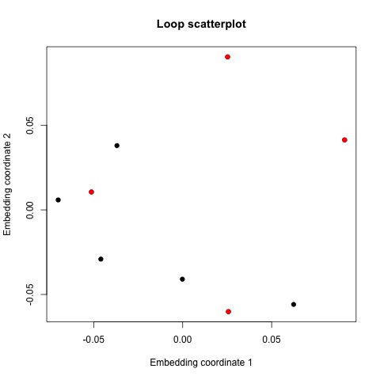
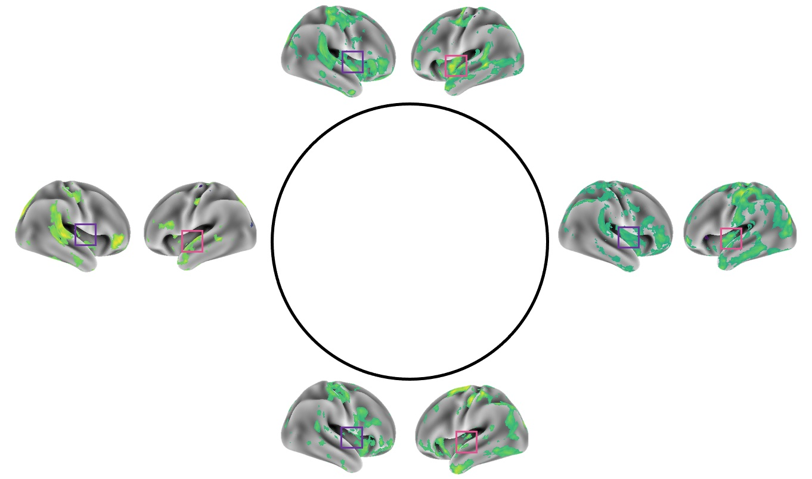

```{r setup, include=FALSE}
knitr::opts_chunk$set(echo = TRUE)
```

# Introduction

A popular technology for studying neural function is called functional magnetic resonance imaging (fMRI), in which oxygenated blood-flow is detected via magnetic resonance, across the brain over multiple time points, as a proxy measurement of neural activity. Spatial activity patterns, i.e. vectors of measured values across space in a single time point, are modulated by task or the absence of task called "resting-state", and can therefore encode meaningful information about neural processing. Collections of spatial activity patterns, for example the spatial patterns evoked by a particular task over multiple time points, have previously been analyzed with (topological) techniques which capture their global structural features [@brain_manifold;@BrainOrganizationMapper;@fMRI_clustering_2;@resting_state_mapper]. However, these analyses are not designed to capture the (spatially) periodic features of fMRI data which we would expect to exist in abundance due to high levels of spatially-autocorrelated noise and signal [@fMRI_noise1;@fMRI_noise2;@Denoising]. On the other hand, higher-dimensional topological features like loops should be ideally suited to capture spatially periodic structures with few dimensions, and have not yet been explored in fMRI data. Moreover, fMRI data is often summarized by the contribution of a number of task-related or resting-state networks, which are linearly-independent spatial patterns [@rs_networks], but non-linear features of collections of spatial patterns may also account for structure in fMRI data. In this vignette we use persistent homology to argue that non-trivial loop structures exist in fMRI spatial patterns and that only few of these loops can account for differences between tasks and subjects.

For our analysis we will use data from the famous Human Connectome Project [@HCP] which contains extensively preprocessed neuroimaging data from roughly 1200 subjects. Of the data collected, fMRI was used to record neural activity while participants completed 9 tasks - two resting-state scans, and an emotion, gambling, language, working memory, relational, social and motor task with two scans per task (resulting in 18 scans per subject). We used only the HCP fMRI data which was projected onto surface nodes -- points, on a mesh of the brain's surface geometry, which are more comparable across subjects than standard 3D volumes [@HCP]. In order to compare data across tasks, which had different numbers of time points, methods are normally required which abstract out temporal information (like correlating activity time series of different brain regions called *functional connectivity*). However, by using topology we can interrogate the geometry of the spatial activity patterns, which we call *spatial activity topology*, without losing potentially task-related temporal information. It was found that that spatial activity topologies in the HCP dataset contained robust 0-dimensional topological features (i.e. clusters of time points with similar spatial patterns) whose persistence values negatively correlated with fluid intelligence [@topological_time_and_space] (i.e. larger differences between spatial patterns at different time points generally corresponded to lower values of fluid intelligence), but higher-dimensional topological features like loops were not considered in their analysis.

Our analysis is comprised of the following steps:

1. Calculating time-point by time-point correlation distance matrices of each fMRI dataset for each subject (transforming correlations $\rho$ into distances $\sqrt{2*(1-\rho)}$, see the appendix for an explanation),
2. Computing thresholded persistence diagrams of dimension 1, the spatial activity topologies, from those distance matrices (using the bootstrap method in **TDApplied**), and 
3. Using machine learning and inference functions from **TDApplied** to analyze the resulting collection of spatial activity topologies.

Steps (1) and (2) are very similar to the analysis carried out in [@topological_time_and_space], except we employ bootstrapping to remove lowly-persistent (i.e. small, likely noise) loops in the data. This is to make comparisons between spatial activity topologies more interpretable, and to determine if physiology drives the most significant loop structures in spatial fMRI data. On the other hand, comparing distance matrices of neurological data is already the basis of a popular analysis method called *representational similarity analysis* (RSA) [@RSA]. Since RSA typically uses linear correlation (distance) to compare matrices rather than topological distances of persistence diagrams computed from those matrices, our analysis may be viewed as a topological variant of RSA. 

We expect that the spatial activity topologies will contain various numbers of loops -- not just two loops as would be the case if the largest-scale topological structures in spatial fMRI data were only driven by physiology (i.e. breathing and heartrate) [@fMRI_noise1;@fMRI_noise2]. The loops should be able to distinguish between the HCP tasks and subjects, with greater differences expected between subjects than between tasks, and data from different subjects should be independent. Since loops are one dimensional (the angle around their major plane parameterizes the position of any point on the loop) but require two linear dimensions (a basis of their major plane) to account for their variance we would also expect that fewer loops would be needed to describe resting-state fMRI data than typical numbers of resting-state networks.

The script used to generate these results, as well as the subject ID's used, can be found in the exec directory of the package. Since the persistence Fisher kernel takes two parameters, $t$ and $\sigma$, we chose a grid over both parameters to perform the independence tests. In the paper [@persistence_fisher], the $\sigma$ values $10^{\{-3,-2,-1,0,1,2,3\}}$ were used for an SVM task. Since our input data had maximum value 1 (due to normalization) we will use the values $10^{\{-3,-2,-1\}} = \{0.001,0.01,0.1\}$. Also in that paper, values of $t$ were selected by taking the 1, 2, 5, 10, 25, 50 percentile values of the Fisher information metric between all of the diagrams (for each value of $\sigma$), and we used the same procedure to select values of $t$ (after subsetting for only positive values). The parameters that resulted from this process are stored in the file `kernel_parameters.csv` in the vignette directory of the package.

# Visualizing spatial activity topologies

What does a spatial activity topology, or a collection of them, represent? Loops in a spatial activity topology are sets of spatially periodic activity patterns which vary along a single neurological dimension. Collections of spatial activity topologies, like combining all of the persistence diagrams from the resting state 1 task across all 100 subjects, could encode both a characteristic number and representative neurological dimensions of loops across the whole collection. In this section we visualize combined diagrams across subjects and tasks, and construct representative loops from all the resting state 1 spatial activity topologies.

We visualized the persistence diagrams of subjects and tasks by combining all the diagrams for that subjects/task and plotting a probability distribution induced by adding a Gaussian point mass centered at each point (like in the Fisher information metric) with $\sigma$ values 0.001, 0.01 and 0.1. Plots with $\sigma = 0.1$ and $\sigma = 0.001$ were least informative because $\sigma$ was comparable to the scale of the data or too fine scale respectively. Here are the distribution plots for three subjects with $\sigma = 0.01$:

```{r,echo = F,eval = T,fig.height = 3,fig.width = 9,fig.align = 'center'}
par(mfrow = c(1,3))
visualize_diagram <- function(diag,sigma,plot_title,lim = NULL){
  
  min_x <- 0
  min_y <- 0
  if(is.null(lim))
  {
    max_x <- max(diag$birth) + 3*sigma
    max_y <- max(diag$death) + 3*sigma
  }else
  {
    max_x <- lim
    max_y <- lim
  }
  
  x = seq(min_x,max_x,(max_x-min_x)/1000)
  y = seq(min_y,max_y,(max_y-min_y)/1000)
  z = outer(x,y,FUN = function(x,y){
    
    sum = 0
    for(i in 1:nrow(diag))
    {
      sum = sum + exp(-((x-diag[i,2])^2 + (y-diag[i,3])^2)/(2*sigma^2))/sqrt(2*pi*sigma^2)
    }
    return(sum)
    
  })
  z = z/sum(z)
  image(x = x,y = y,z,main = plot_title,xlab = "Birth",ylab = "Death",xlim = c(min_x,max_x),ylim = c(min_y,max_y))
  graphics::abline(a = 0,b = 1)
  
}

rest1 <- read.csv("rest1.csv")
rest1$X <- NULL

rest2 <- read.csv("rest2.csv")
rest2$X <- NULL

emotion <- read.csv("emotion.csv")
emotion$X <- NULL

gambling <- read.csv("gambling.csv")
gambling$X <- NULL

language <- read.csv("language.csv")
language$X <- NULL

motor <- read.csv("motor.csv")
motor$X <- NULL

relational <- read.csv("relational.csv")
relational$X <- NULL

social <- read.csv("social.csv")
social$X <- NULL

wm <- read.csv("wm.csv")
wm$X <- NULL

max_birth_task <- max(max(rest1$birth),max(rest2$birth),max(emotion$birth),max(gambling$birth),max(language$birth),max(motor$birth),max(social$birth),max(relational$birth),max(wm$birth)) + 3*0.001

max_death_task <- max(max(rest1$death),max(rest2$death),max(emotion$death),max(gambling$death),max(language$death),max(motor$death),max(social$death),max(relational$death),max(wm$death)) + 3*0.001

lim_task <- max(c(max_birth_task,max_death_task))

s105620 <- read.csv("s105620.csv")
s105620$X <- NULL

s117122 <- read.csv("s117122.csv")
s117122$X <- NULL

s118023 <- read.csv("s118023.csv")
s118023$X <- NULL

max_birth_subj <- max(max(s105620$birth),max(s117122$birth),max(s118023$birth)) + 3*0.01

max_death_subj <- max(max(s105620$death),max(s117122$death),max(s118023$death)) + 3*0.01

lim_subj <- max(c(max_birth_subj,max_death_subj))

visualize_diagram(s105620,sigma = 0.01,plot_title = "Subject 105620",lim = lim_subj)
visualize_diagram(s117122,sigma = 0.01,plot_title = "Subject 117122",lim = lim_subj)
visualize_diagram(s118023,sigma = 0.01,plot_title = "Subject 118023",lim = lim_subj)
```

As we can see the distributions were very different between these three subjects. Next we visualized the nine tasks (again with $\sigma = 0.01$):

```{r,echo = F,eval = T,fig.height = 9,fig.width = 9,fig.align = 'center'}
par(mfrow = c(3,3))
visualize_diagram(rest1,sigma = 0.01,plot_title = "Resting state 1",lim = lim_task)
visualize_diagram(rest2,sigma = 0.01,plot_title = "Resting state 2",lim = lim_task)
visualize_diagram(emotion,sigma = 0.01,plot_title = "Emotion",lim = lim_task)
visualize_diagram(gambling,sigma = 0.01,plot_title = "Gambling",lim = lim_task)
visualize_diagram(language,sigma = 0.01,plot_title = "Language",lim = lim_task)
visualize_diagram(motor,sigma = 0.01,plot_title = "Motor",lim = lim_task)
visualize_diagram(relational,sigma = 0.01,plot_title = "Relational",lim = lim_task)
visualize_diagram(social,sigma = 0.01,plot_title = "Social",lim = lim_task)
visualize_diagram(wm,sigma = 0.01,plot_title = "Working memory",lim = lim_task)
```

Again we found that the tasks had visually different distributions, although the two resting state scans are fairly similar, as we would expect, with one main cluster of loops of birth and death radius just less than 0.2.

But what do these mental state loops represent in terms of brain activity? As an illustration we considered the resting state 1 persistence diagram and used kmeans clustering [@murphyML] to find two "basis" resting state 1 loops which described all of the loops well:

```{r,echo = F,eval = T,fig.height = 4,fig.width = 4,fig.align = 'center'}
par(mfrow = c(1,1))
visualize_diagram(rest1,sigma = 0.01,plot_title = "Resting state 1 with one main loop")
points(x = c(mean(rest1[,2])),y = c(mean(rest1[,3])),pch = 19)
```

This loop was from one subject's resting state 1 data, but note that topologically similar loops (in terms of birth and death values) may lie in different parts of the data (i.e. represent different loops of spatial activity patterns). We calculated the representative cycle of this loops, used `cmdscale` to project the representative into 2D and selected a top, bottom, left and right points along the loops (in red): 

```{r,echo = F,eval = T,fig.height = 4,fig.width = 4,fig.align = 'center'}

```

Since the highlighted points from the plot each represent a spatial pattern of neural activity at some time point, we then plotted these spatial patterns around the circumference of a circle (however, the loop did not form a perfect circle in the data). Note that when the two brain hemispheres (i.e. sides) are plotted side-by-side, the left hemisphere is on the right and the right hemisphere is on the left. Prior to plotting, the fMRI data was first normalized to have temporal mean 0 and standard deviation 1 for each surface node. The spatial patterns were then smoothed by averaging spatial signal within a 5mm radius from each surface node, and the smoothed signal was thresholded by absolute value at least 0.75. We plotted the spatial patterns with boxes around regions which appeared to exhibit periodic behavior around the loop:

```{r,echo = F,eval = T,fig.height = 4,fig.width = 4,fig.align = 'center'}

```

We compared the locations of periodic activity (in the boxes) to a well-known parcellation of the brain into 7 resting-state networks [@rs_networks]:

```{r,echo = F,eval = T,fig.align = 'center',out.width="80%", out.height="80%"}
knitr::include_graphics("parcellation.jpg")
```

The periodic behavior in the boxes appeared mainly in the activation of the ventral attention network (high activity on top and right, lower activity on bottom and left), and thus one resting-state network could be used to represent the structure of this subject's data. Therefore, it is possible that not all of the seven resting-state networks may be needed to describe the group-level resting-state data.

Coming up with techniques for determining what the one circular dimension of one such loop represents in terms of neural activity, and determining if this dimension is correlated with time/study design (i.e. the temporal sequence of events in the task) for resting-state/task-based fMRI is left to future work.

# Comparing subjects and tasks with inference

Having visualized spatial activity topologies and one of their loops, we will now investigate differences in various distributions based on these topologies between subjects and between tasks. We first analyzed basic properties of the persistence diagrams -- the number of loops and the mean persistence of loops, both across subjects and tasks. The overall distribution of the number of loops across all diagrams was:

```{r,echo = F,eval = T,fig.height = 4,fig.width = 4,fig.align = 'center'}
par(mfrow = c(1,1))
num_loops = c(1335,384,51,18,8,2,2)
names(num_loops) = c(0,1,2,3,4,5,6)
barplot(num_loops,xlab = "Number of significant loops in the diagram")
```

The bootstrap thresholding was evidently very conservative, with about 74\% of the diagrams containing no loops. This is not to say that those diagrams were topologically trivial -- on the contrary they may have contained non-trivial higher-dimensional topological structure, or it is possible that task-correlated loops may exist at smaller (i.e. less persistent) scales. To assess the validity of either explanation we would require significantly more computational resources than what was available at the time of writing, and we leave this to future work. 

We may draw two important conclusions from this graphic. Firstly, the fact that many diagrams did not have any loops provides evidence that large-scale topological structure was not driven by physiological sources, such as heart-rate and breathing. Secondly, resting-state analyses are often concerned with the activity of (about) seven major "resting-state networks" found in [@rs_networks], and task analyses often study the activity of a similar numbers of task-specific networks. However, our loop analysis found that fewer loop dimensions (perhaps up to 1 loop) were needed to describe the HCP data, suggesting high-dimensional topological features may be a useful low-dimensional representation of spatial fMRI data.

We then compared the distribution of the number of loops across subjects and tasks using paired t-tests (with two-sided alternative hypotheses and at the $\alpha = 0.05$ threshold for type 1 error). About 22\% of the subject-subject pairs had statistically different numbers of loops, and about 28\% of the task-task pairs had statistically significant numbers of loops. Interestingly, half of the differences between tasks were found between resting state scans and task scans, with more loops in the resting state scans, suggesting that tasks may induce small-scale specialized cycles of mental states which are used to accomplish the task.

Next we performed the same analysis for the mean persistence of loops in the diagrams. About 19\% of the subject-subject pairs had differences in mean persistence values. We found 31\% statistically different persistence between tasks, mainly being higher persistence in resting state scans compared to task-based scans.

In order to better understand subject-subject and task-task differences we used **TDApplied**'s permutation test to compare subjects (matched by task) and tasks with both the 2-wasserstein and bottleneck distances, again judging significance at the $\alpha = 0.05$ level. For the subjects, both bottleneck and wasserstein distances found about 24\% of the subject-subject pairs to have different topologies, with about 94\% of the differences conserved between the two metrics. For the tasks, in the bottleneck tests there were 12 pairs of different tasks, seven of which were between one of the resting state scans with another task, and for the wasserstein tests there were only two pairs of different tasks (resting state 2 with emotional and relational), but the two resting state scans were not different from each other in either case. Therefore, the resting state scans were more different from task scans than the task scans were with each other. 

Finally, we analyzed whether any of the subject-subject or task-task pairs were independent (again at the $\alpha = 0.05$ significance level). Only about 27% of the subject-subject pairs were significantly non-independent in at least 50\% of kernel parameters -- an interesting future question would be to determine whether these non-independent pairs were blood-related. On the other hand, over 89\% of the task-task pairs were found to be significantly non-independent in at least half of the kernel parameter values. Therefore, task-induced spatial activity topology may be strongly related between tasks -- i.e. computational strategies in different neural domains may be related. In order to compare the results of the two inference procedures, we used two-sided t-tests to compare the percentage of those kernel values which found significant non-independence between subject-subject pairs who were significantly different in the permutation tests compared to pairs of subjects who were not significantly different in the tests (for both distance metrics). The results were very similar for both distance metrics, with significantly lower percentage of non-independence in non-different subject-subject pairs.

# Machine learning

Our inference analyses revealed some of the underlying topological differences of rest and task-induced fMRI spatial patterns in the HCP dataset. However, what is the overall structure of the space of all the diagrams? In this section we will first cluster the diagrams to find distinct mental-state topological "modes", and then visualize the clusters using 2D MDS computed with both the bottleneck and wasserstein metrics.

Using all of the kernel parameters deduced earlier, we performed kernel kmeans clustering on all the persistence diagrams over a range of values of k -- 2,3,4,...,18,25,50,100. These values were chosen because there were 18 scans per subject and 100 subjects. The within-cluster sum of squared (withinss) distances were calculated for each value of k and for each kernel parameter combination, and the value of k which minimized the withinss (without resulting in empty clusters) was selected as being optimal for each kernel parameter. The frequency of each number of optimal clusters was:

```{r,echo = F,fig.height = 4,fig.width = 4,fig.align = 'center'}
num_clusters <- c(14,13,12,10,2,2,1)
names(num_clusters) <- c(2,3,4,5,6,7,8)
num_clusters <- c(rep(2,14),rep(3,13),rep(4,12),rep(5,10),rep(6,2),rep(7,2),rep(8,1))

barplot(table(num_clusters),xlab = "Optimal number of clusters",main = "")
```

The optimal number of clusters was between 2 and 5. We therefore performed clustering with all those values of k for all kernel parameters, and calculated a membership percentage matrix for each value of k -- for what percentage of kernel parameters was each pair of subjects in the same cluster. For each value of k we computed the percentage of pairs of subject who were in the same cluster at least 90\% of the time, and the percent which were in the same cluster at most 5\% of the time -- when k was two these percentages were 61\% and 37\%, when k was 3 they were 55\% and 36\%, when k was 4 they were 55\% and 37\%, and when k was 5 they were 0\% and 38\% (about 55\% were in the same cluster over 50\% of the time). These results indicate that the clusterings for k being 2, 3 and 4 were highly consistent across all kernel parameters. We then used the kernlab function `kkmeans` to cluster the three membership matrices, and only for k = 2 and 3 was the clustering able to be resolved (potentially due to the membership matrix not being a real kernel matrix). However, the clustering with k = 2 just returned the partition of diagrams into non-empty vs. empty, so it was not super interesting. We therefore visualized the group of diagrams in each of the three found clusters:

```{r,echo = F,eval = T,fig.height = 3,fig.width = 9,fig.align = 'center'}
par(mfrow = c(1,3))
cluster1 = read.csv("cluster1.csv")
cluster1$X = NULL

cluster2 = read.csv("cluster2.csv")
cluster2$X = NULL

cluster3 = read.csv("cluster3.csv")
cluster3$X = NULL

max_birth_clust <- max(max(cluster1$birth),max(cluster2$birth),max(cluster3$birth)) + 3*0.001

max_death_clust <- max(max(cluster1$death),max(cluster2$death),max(cluster3$death)) + 3*0.001

lim_clust <- max(c(max_birth_clust,max_death_clust))

visualize_diagram(cluster1,sigma = 0.01,plot_title = "Cluster 1",lim = lim_clust)
visualize_diagram(cluster2,sigma = 0.01,plot_title = "Cluster 2",lim = lim_clust)
visualize_diagram(cluster3,sigma = 0.01,plot_title = "Cluster 3",lim = lim_clust)
```

The three clusters are quite distinct in terms of what topological information they likely represent. For cluster one this is mainly one large loop-type (with mean persistence in the cluster of about 0.007), for cluster two this is two loop-types of variable size (mean persistence in the cluster of about 0.005), and cluster 3 is comprised of a single low-persistence (0.002) loop.

Next we analyzed the number of rows in the diagrams of each cluster. The results were as follows:

```{r,echo = F}
print("Cluster 1:")
c("1" = 223,"2" = 51,"3" = 18,"4" = 8,"5" = 2,"6" = 2)

print("Cluster 2:")
c("1" = 160)

print("Cluster 3:")
c("0" = 1335,"1" = 1)
```

Cluster 1 had more loops than the other clusters on average, cluster 2 diagrams had only one loop, and that cluster mainly retrieved the empty diagrams.

Next we analyzed the task composition of clusters, and found the following percentages (rounded to the hundredths position and ordered by most to least rounded variance across the clusters):

```{r,echo = F}
print("Cluster 1:")
c("emotion" = 0.06,"gambling" = 0.12,"language" = 0.11,"motor" = 0.10,"relational" = 0.11,"rest1" = 0.16,"rest2" = 0.14,"social" = 0.11,"wm" = 0.10)[c("rest1","rest2","emotion","gambling","social","motor","relational","language")]

print("Cluster 2:")
c("emotion" = 0.15,"gambling" = 0.18,"language" = 0.13,"motor" = 0.04,"relational" = 0.1,"rest1" = 0.04,"rest2" = 0.06,"social" = 0.14,"wm" = 0.15)[c("rest1","rest2","emotion","gambling","social","motor","relational","language")]

print("Cluster 3:")
c("emotion" = 0.12,"gambling" = 0.10,"language" = 0.11,"motor" = 0.12,"relational" = 0.11,"rest1" = 0.11,"rest2" = 0.11,"social" = 0.11,"wm" = 0.11)[c("rest1","rest2","emotion","gambling","social","motor","relational","language")]
```

Cluster 1 had higher percentages of resting state scans compared to the other clusters. However, compared to cluster 2 it also had lower percentages of emotion, gambling and social tasks, and a higher percent of motor tasks. Clusters 2 and 3 were moreso separated by percentages of resting state 2 and motor (more in cluster 3), and gambling (more in cluster 2).

We then calculated 2D MDS embeddings of all the diagrams using both the wasserstein and bottleneck distances, and the cluster labels did a reasonably good job at separating the embedded points:

```{r,echo = F,eval = T,fig.height = 3,fig.width = 9,fig.align = 'center'}
par(mfrow = c(1,3))

mds_bottleneck = read.csv("mds_bottleneck.csv")
mds_bottleneck$X = NULL

mds_wass = read.csv("mds_wass.csv")
mds_wass$X = NULL

color = c("1" = "#000000","2" = "#E69F00","3" = "#0072B2")[read.csv("cluster_labels.csv")$label]
names(color) = NULL

plot(x = mds_bottleneck$V1,y = mds_bottleneck$V2,xlab = "Dim 1",ylab = "Dim 2",main = "Bottleneck MDS",col = color,pch = 19)
plot(x = mds_wass$V1,y = mds_wass$V2,xlab = "Dim 1",ylab = "Dim 2",main = "Wasserstein MDS",col = color,pch = 19)
plot(NULL ,xaxt='n',yaxt='n',bty='n',ylab='',xlab='', xlim=0:1, ylim=0:1)
graphics::legend("top", pch=19, pt.cex=3, cex=1.5, bty='n',
    legend = c("Cluster 1","Cluster 2","Cluster 3"),col = c("#000000","#E69F00","#0072B2"))
graphics::mtext("Cluster label",cex=2)
```

Behavioral measures may correlate with the spatial activity topologies, and therefore may be explaining some of the variance within the plots (for instance why cluster 1 seemed to be more 2 dimensional in the bottleneck embedding compared to being more 1 dimensional in the wasserstein embedding), and this could be an interesting future analysis.

# Conclusion

We analyzed large-scale spatial loops in HCP spatial activity topologies using **TDApplied**, and found interesting differences across subjects and tasks. Visual and statistical differences between subjects were found, and highly-persistent loops did not appear to be driven by physiology. Inter-related loops emerged across tasks, and fewer loops, compared to resting-state networks, were needed to describe the fMRI data. Three main signatures of loop structures existed across all subjects and tasks, suggesting largely shared functional strategies across subjects and domains, and these signatures were low dimensional in their variation. Overall our results point towards the utility of high (above 0) dimensional topology in finding task-related and subject-specific patterns in fMRI spatial patterns.

# Appendix: Converting Correlations to Distances

In our analysis of HCP data we converted correlation values to correlation distance values using the formula $\rho \rightarrow \sqrt{2*(1-\rho)}$. To see why this transformation does produce distance values, let $X$ and $Y$ be two vectors (of the same length $n$) with 0 mean and unit variance. Then $\rho(X,Y) = \frac{Cov(E,Y)}{\sigma_{x}\sigma_{y}} = \frac{E[(X-0)(Y-0)]}{(1)(1)} = E[XY] = \frac{\sum_{i = 1}^{n}X_i Y_i}{n}$. The Euclidean distance of $X$ and $Y$ is therefore $d(X,Y) = \sqrt{\sum_{i=1}^{n}(X_i-Y_i)^2} = \sqrt{\sum_{i=1}^{n}X_i^2 + \sum_{i=1}^{n}Y_i^2 -2\sum_{i=1}^{n}X_i Y_i} = \sqrt{n + n - 2\rho(X,Y)} = \sqrt{2n(1-\rho(X,Y))} \propto \sqrt{2(1-\rho(X,Y))}$. Therefore, since a scaled distance metric (by a positive number like $\sqrt{n}$) is also a distance metric (this is very easy to verify), the transformation $\rho \rightarrow \sqrt{2*(1-\rho)}$ indeed gives distance values. Note that in [@topological_time_and_space] a proportional transformation was used $\rho \rightarrow \sqrt{1-\rho} \propto \sqrt{2(1-\rho)}$ and therefore our results are consistent with those found in that work.

## References
