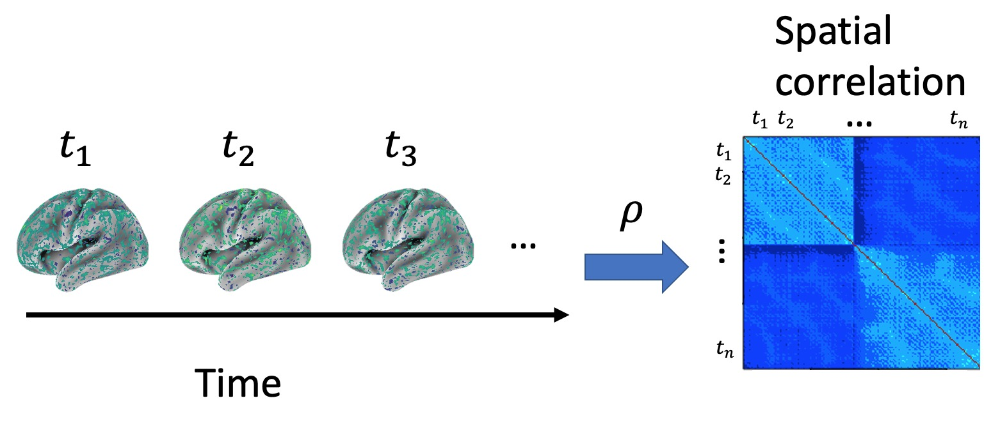
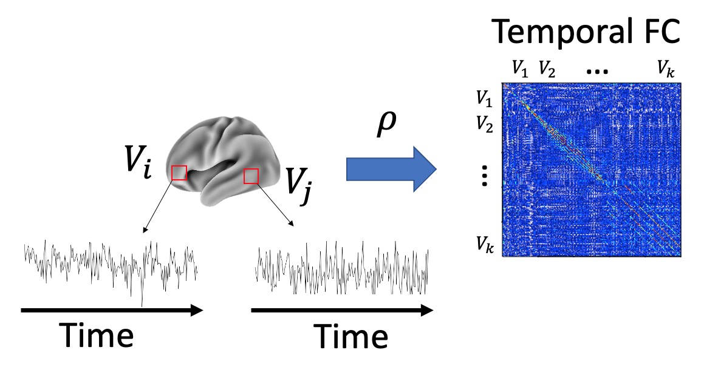
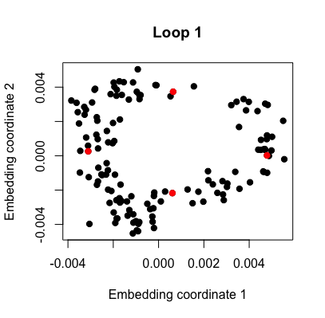
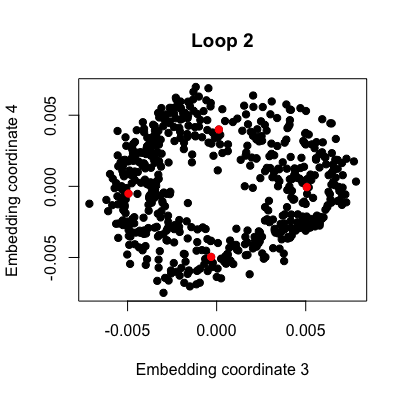
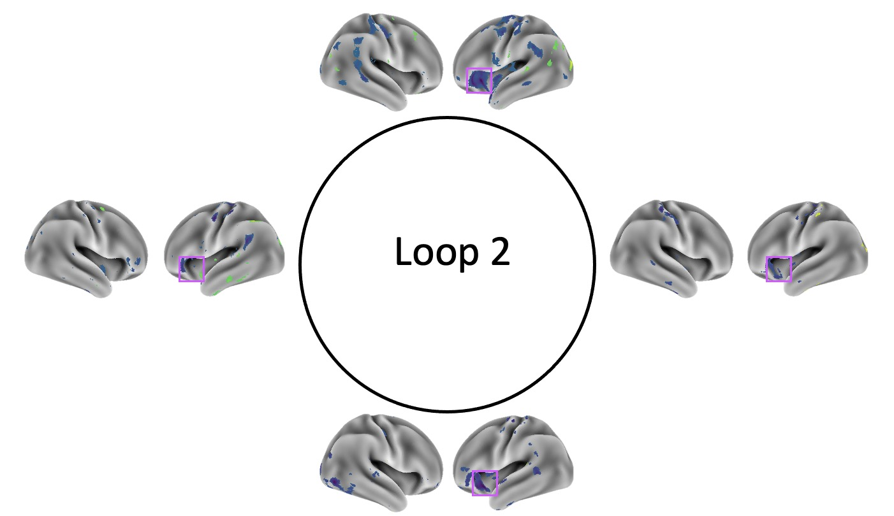
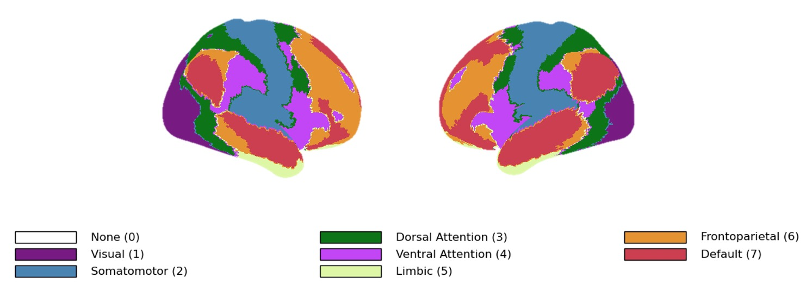

```{r, include = FALSE}
knitr::opts_chunk$set(
  collapse = TRUE,
  comment = "#>"
)
# get original graphic parameters to be able to
# revert back at the end of the vignette
original_mfrow <- par()$mfrow
original_xpd <- par()$xpd
original_mar <- par()$mar
original_scipen <- options()$scipen
options(scipen = 999)
```

# Introduction

Topological data analysis is a relatively new area of data science which can compare and contrast data sets via non-linear global structure. The main tool of topological data analysis, *persistent homology* [@PHoriginal;@ComputingPH], builds on techniques from the field of algebraic topology to describe shape features present in a data set (stored in a "persistence diagram"). Persistent homology has been used to show that the topology of human brain function can distinguish healthy control subjects vs. subjects with a neurological disorder [@TDA_ADHD;@TDA_Alzheimers;@persistent_hom_brain_networks], the topology of stock price correlations over time can be used to detect stock market crashes [@PHeconomics], local patches of naturalistic images contain non-trivial and complex topological structure [@PHpatches], etc.

Distance and kernel functions are used to calculate differences and similarities respectively between objects in complicated spaces, and are the foundation of many machine learning algorithms which are used in traditional data science [@murphyML]. Several papers have used distance and kernel computations tailored to persistence diagrams [@distance_calc;@persistence_fisher] in order to perform machine learning or inference tasks with groups of persistence diagrams, but to date no publicly available software in either R or python provides the functionality for these types of analyses.

Two main R packages exist for computing and comparing persistence diagrams -- TDA [@R-TDA] and TDAstats [@R-TDAstats]. While both packages have been used to carry out topological data analysis in R, neither package supports machine learning with groups of persistence diagrams because both lack a kernel function. TDAstats has an inference method; however, it is based on a non-standard distance function (making inferences drawn from this function unsubstantiated). TDA has a standard distance function but no inference function (and also stores persistence diagrams in a non-standard data structure, which requires additional preprocessing steps for further analysis).

In order to make the power of topological data analysis more readily available to data and machine learning practitioners, it would be very helpful to have a single software package that can

1. deliver a fast engine for calculating persistence diagrams,
2. convert persistence diagrams computed using the \texttt{R} packages \textit{TDA} and \textit{TDAstats} into a commonly-used data type for data analyses (a data frame), 
3. implements fast versions of both distance and kernel calculations for pairs of persistence diagrams, 
4. contribute tools for interpreting persistence diagrams, and
5. provide parallelized methods for machine learning and inference for persistence diagrams.

In accomplishing these goals TDApplied is a comprehensive and optimized package which permits researchers and data scientists to analyze multiple data sets using machine learning and inference via topological data analysis. This vignette documents the theory and application of TDApplied functions, on both simulated and neuroscience data.

<!-- Topological data analysis is a relatively new area of data science which can find unique, non-linear global structure in whole datasets. The main tool of topological data analysis is called *persistent homology*, which produces a "shape descriptor" (called a *persistence diagram*) of its input dataset. Two main R packages exist for computing persistence diagrams; the more flexible of the two, called TDA, stores persistence diagrams in a non-standard data structure, and the faster of the two, called TDAstats, does not provide functionality for analyzing diagrams with published techniques. Methods exist for computing distances and kernels (which are a special type of similarity functions) between pairs of persistence diagrams, but only distance calculations are currently available in the R package TDA. Several papers have used distance and kernel computations in order to perform machine learning or inferences tasks with groups of persistence diagrams, but to date no publicly available software in either python or R provides the functionality for these types of analyses. In order to make the power of topological data analysis more readily available to data and machine learning practitioners, it would be very helpful to have a single software package that can -->

<!-- 1. convert persistence diagrams computed using the R packages TDA and TDAstats into a commonly-used data type for data analyses (a data frame),  -->

<!-- 2. implement fast versions of both distance and kernel calculations for pairs of persistence diagrams,   -->
<!-- 3. provide scalable methods for machine learning and inference for persistence diagrams, -->

<!-- 4. deliver a fast engine for calculating persistence diagrams, and -->

<!-- 5. contribute tools for interpreting persistence diagrams. -->

<!-- It is with these goals that the package TDApplied was created. -->

# Software Review

Topological data analysis has gained popularity over the past two decades since the original paper on persistent homology was published [@PHoriginal], and two main R packages have been created for topological data analysis:

1. The R package TDA [@R-TDA] is a wrapper for a number of C++ persistent homology packages, including Dionysus [@Dionysus], GUDHI [@GUDHI] and PHAT [@PHAT], and provides both distance calculation capabilities between persistence diagrams and the ability to find representative data points of each topological feature in a persistence diagram (the points for each feature are called a "representative cycle"). Moreover, a method is provided for determining which topological features in a persistence diagram should be considered "real" from a statistical perspective.
2. The R package TDAstats [@R-TDAstats] is a wrapper of the C++ persistent (co)homology engine Ripser [@Ripser;@PChom], and provides an inference method for detecting group differences of two groups of persistence diagrams (as in [@Robinson_Turner]. However, the distance calculation currently implemented in that package, is not based on an accepted distance metric for persistence diagrams. 

The paper [@PH_benchmarking] compared the runtimes of the homology calculations in the R packages TDA and TDAstats, and concluded that certain persistent homology calculations are faster with TDAstats. The choice of which package to use therefore may vary by application, depending on whether speed is desired or whether knowledge of which data points represent which topological feature. Therefore, TDApplied can accept as input persistence diagrams computed from either package in order to cover a wide variety of potential use-cases.

It is worthwhile to note that there are two other R packages for carrying out topological data analysis - TDAvec [@TDAvec] (methods for vectorizing persistence diagrams) and TDAkit [@TDAkit] (clustering and dimension reduction methods for functional summaries of persistence diagrams, called persistence landscapes/silhouettes), as well as several python packages dedicated to topological data analysis calculations, including scikit-TDA [@scikittda2019] (which computes persistence diagrams, and distances/kernels between them, using several python libraries), and giotto-tda [@tauzin2020giottotda] (which computes persistence diagrams and uses persistence diagrams to analyze time series data).

There are a number of shortcomings of available topological data analysis software. Firstly, in both python and R there is currently no package which allows for machine learning and inference of persistence diagrams, a limitation which greatly constrains the types of analyses that can be carried out. In R this is partially because there is no package for kernel calculations of persistence diagrams, but the very slow computation of distances between persistence diagrams in the TDA package also inhibits the practicality of distance-based inference procedures. Additionally, in R, the output of persistent homology calculations from the package TDA is a list with an element called "diagram" of class "diagram", which is not compatible with data frame methods that form the basis for data analysis in R. On the other hand, TDAstats does not compute a published distance metric for persistence diagrams, making inferences drawn from its `permutation_test` function unclear. Overall, the non-standard data type returned by persistent homology calculations in TDA, the slow distance calculations in TDA and the non-published distance metric in TDAstats may be limiting the development of TDA applications in R.

# Package TDApplied

The package TDApplied aims to solve the five goals outlined in the introductory paragraph. Firstly, the function `diagram_to_df` allows the conversion of the output of TDA persistent homology calculations to a data frame. Secondly, the functions `diagram_distance` and `diagram_kernel` allow for fast distance and kernel calculations respectively, and their counterparts `distance_matrix` and `gram_matrix` compute in parallel, for scalability, the (cross) distance and (cross) Gram matrices respectively. Thirdly, these distance and kernel calculations are used to perform machine learning and inference on persistence diagrams. Methods include 

1. dimension reduction with metric multidimensional scaling (MDS) and kernel principal components analysis (kpca),
2. clustering with kernel k-means,
3. regression and classification with kernel support-vector machines (ksvm), and
4. inference with distance and kernel calculations looking for group differences and group independence, respectively.

The kernel machine learning methods implemented in TDApplied are wrappers of the flexible R package for kernel calculations kernlab [@R-kernlab], with some additional processing steps specific to persistence diagrams. Fourthly, a fast method for computing persistence diagrams via python is implemented in the `PyH` function. Finally, interpretative tools for persistence diagrams include the `plot_diagram` function for plotting persistence diagrams and the `bootstrap_persistence_thresholds` function for determining which topological features in a dataset should be considered "real". In the subsequent sections we will describe these applications in more detail.

# Background: Persistent Homology

The main tool of topological data analysis is called persistent homology (see [@PHoriginal] for the introductory paper, and [@ComputingPH] for further computational details). Persistent homology has been applied in a variety of areas, including (but not limited to) economics (largely for the application of time series, for example see [@PHeconomics]), neuroscience (see [@review_of_PH_for_fMRI] for a number of functional MRI applications), etc. 

Persistent homology starts with data points and a distance function. It assumes that these points were sampled from some kind of shape. This shape has certain features that exist at various scales, but sampling induces noise in these features. Persistent homology aims to describe certain mathematical features of this underlying shape, by forming approximations to the shape at various distance scales. The mathematical features which are tracked are clusters (connected components), loops (ellipses), voids (spheres), etc, and the "significance" of each feature is calculated (i.e. are the feature "real" or not). The *homological dimension* of these features are 0, 1 and 2 respectively (higher dimensional features can also be calculated). What's really interesting about these particular mathematical features is that they can tell us where our data is not, which is extremely important information which other data analysis methods can't provide.

```{r,echo = F,fig.height = 3,fig.width = 7,fig.align = 'center'}
circ <- TDA::circleUnif(n = 50,r = 1)
par(mfrow = c(1,4))
plot(x = circ[,1],y = circ[,2],main = "Approximation 1:\nindividual data points",xlab = "",ylab = "",las = 1)
plot(x = circ[,1],y = circ[,2],main = "Approximation 2:\nnot a loop",xlab = "",ylab = "",las = 1)
for(i in 1:(nrow(circ)-1))
{
  for(j in (i+1):nrow(circ))
  {
    if(sqrt((circ[i,1]-circ[j,1])^2+(circ[i,2] - circ[j,2])^2) <= 0.2)
    {
      lines(c(circ[i,1],circ[j,1]),c(circ[i,2],circ[j,2]))
    }
  }
}
plot(x = circ[,1],y = circ[,2],main = "Approximation 3:\nloop",xlab = "",ylab = "",las = 1)
for(i in 1:(nrow(circ)-1))
{
  for(j in (i+1):nrow(circ))
  {
    if(sqrt((circ[i,1]-circ[j,1])^2+(circ[i,2] - circ[j,2])^2) <= 1)
    {
      lines(c(circ[i,1],circ[j,1]),c(circ[i,2],circ[j,2]))
    }
  }
}
plot(x = circ[,1],y = circ[,2],main = "Approximation 4:\nnot a loop",xlab = "",ylab = "",las = 1)
for(i in 1:(nrow(circ)-1))
{
  for(j in (i+1):nrow(circ))
  {
    if(sqrt((circ[i,1]-circ[j,1])^2+(circ[i,2] - circ[j,2])^2) <= 2)
    {
      lines(c(circ[i,1],circ[j,1]),c(circ[i,2],circ[j,2]))
    }
  }
}
par(mfrow = c(1,1))
```

The persistent homology algorithm proceeds in the following manner: first, if the input is a dataset and distance metric, then the distance matrix, storing the distance metric value of each pair of points in the dataset, is computed. Next, a parameter $\epsilon \geq 0$ is grown starting at 0, and at each $\epsilon$ value we compute a shape approximation of the dataset $C_{\epsilon}$, called a *simplicial complex* (see [@PHoriginal] or [@ComputingPH] for more details). We construct $C_{\epsilon}$ by connecting all pairs of points whose distance is at most $\epsilon$. To encode higher-dimensional structure in these approximations, we also add a triangle between any triple of points which are all connected, a tetrahedron between any quadruple of points which are all connected, etc. Note that this process of forming a sequence of skeletal approximations is called a filtration, and other methods exist for forming the approximations (the one described here is the most commonly used, called the *Rips-Vietoris* complex).

At any given $\epsilon$ value, some topological features will exist in $C_{\epsilon}$. As $\epsilon$ grows, the $C_{\epsilon}$'s will contain each other, i.e. if $\epsilon_{1} < \epsilon_{2}$ then every edge (triangle, tetrahedron etc.) in $C_{\epsilon_1}$ will also be present in $C_{\epsilon_2}$. Therefore, each topological feature will be "born" at some $\epsilon_{birth}$ value, and "die" at some some $\epsilon_{death}$ value. Consider the example of a loop -- a loop will be "born" when the last connection around the circumference of the loop is connected (at the $\epsilon$ value which is the largest distance between consecutive points around the loop), and the loop will "die" when the last connection across the loop's diameter is connected thereby filling in its hole.

Therefore, the output of persistent homology, a persistence diagram, in each dimension has one 2D point for each topological feature found in the filtration process, where the $x$-value of the point is the birth $\epsilon$ value and the $y$-value is the death $\epsilon$ value. This is why every point lies above the diagonal -- features die after they are born! The difference of a points $y$ and $x$ value, $y-x$, is called the "persistence" of the corresponding topological feature. Points which have high (large) persistence likely represent real topological features of the dataset, whereas points with low persistence likely represent topological noise.

A persistence diagram containing $n$ topological features can be represented in a vector of length $2n$. However, persistence diagrams can contain different numbers of features, and the ordering of the features is arbitrary. There, there is no obvious vector representation of all persistence diagrams that can be used as the input of machine learning or statistical inference. Nevertheless, we can apply a number of these techniques to persistence diagrams provided we can quantify how near (similar) or far (distant) they are from each other, and describing suitable distance and similarity measures with their accompanying analysis methods will be the content of the following section.

# TDApplied Methods and Underlying Theory

In this section we will describe the various computational tools implemented in the package TDApplied to analyze persistence diagrams, both explaining the mathematics and providing functional examples. To run our examples we must start by loading the TDApplied package:

```{r setup}
library("TDApplied")
#devtools::load_all()
``` 

Since TDApplied uses the output of TDA/TDAstats calculations (or its own persistent homology function, "PyH", discussed later) as inputs to its functions, either TDA or TDAstats should be at least installed (if not attached) when using TDApplied. All examples, except those in the subsection on bootstrapping, will analyze simple diagrams which are random deviations of three persistence diagrams called D1, D2 and D3 (each with points in dimension 0 only), which we will plot with the TDApplied function `plot_diagram`:

```{r,echo = T,fig.height = 3,fig.width = 7,fig.align = 'center'}
D1 = data.frame(dimension = c(0),birth = c(2),death = c(3))
D2 = data.frame(dimension = c(0),birth = c(2,0),death = c(3.3,0.5))
D3 = data.frame(dimension = c(0),birth = c(0),death = c(0.5))
par(mfrow = c(1,3))
plot_diagram(D1,title = "D1",max_radius = 4,legend = F)
plot_diagram(D2,title = "D2",max_radius = 4,legend = F)
plot_diagram(D3,title = "D3",max_radius = 4,legend = F)
```

```{r,echo = F}
par(mfrow = c(1,1))
```

When desired, random Gaussian noise with a small variance will be added to the birth and death values of the points in these three diagrams (being careful make sure the points always have appropriate birth and death values), which will be achieved with a function (only used in this vignette), `generate_TDApplied_vignette_data`. 

```{r,echo = F}
generate_TDApplied_vignette_data <- function(num_D1,num_D2,num_D3){
  
  # num_D1 is the number of desired copies of D1, and likewise
  # for num_D2 and num_D3
  
  # create data
  D1 = data.frame(dimension = c(0),birth = c(2),death = c(3))
  D2 = data.frame(dimension = c(0),birth = c(2,0),death = c(3.3,0.5))
  D3 = data.frame(dimension = c(0),birth = c(0),death = c(0.5))
  
  # make noisy copies
  noisy_copies <- lapply(X = 1:(num_D1 + num_D2 + num_D3),FUN = function(X){
    
    # i stores the number of the data frame to make copies of:
    # i = 1 is for D1, i = 2 is for D2 and i = 3 is for D3
    i <- 1
    if(X > num_D1 & X <= num_D1 + num_D2)
    {
      i <- 2
    }
    if(X > num_D1 + num_D2)
    {
      i <- 3
    }
    # store correct data in noisy_copy
    noisy_copy <- get(paste0("D",i))
    
    # add Gaussian noise to birth and death values
    n <- nrow(noisy_copy)
    noisy_copy$dimension <- as.numeric(as.character(noisy_copy$dimension))
    noisy_copy$birth <- noisy_copy$birth + stats::rnorm(n = n,mean = 0,sd = 0.05)
    noisy_copy$death <- noisy_copy$death + stats::rnorm(n = n,mean = 0,sd = 0.05)
    
    # make any birth values which are less than 0 equal 0
    noisy_copy[which(noisy_copy$birth < 0),2] <- 0
    
    # make any birth values which are greater than their death values equal their death values
    noisy_copy[which(noisy_copy$birth > noisy_copy$death),2] <- 
      noisy_copy[which(noisy_copy$birth > noisy_copy$death),3]
    return(noisy_copy)
    
  })
  
  # return list containing num_D1 noisy copies of D1, then
  # num_D2 noisy copies of D2, and finally num_D3 noisy copies
  # of D3
  return(noisy_copies)
  
}
```

Here is an example of making noisy copies of D1:

```{r,echo = F,fig.height = 5,fig.width = 5,fig.align = 'center'}
par(mar=c(5.1, 4.1, 4.1, 8.1), xpd=TRUE)
noisy_copies_D1 = generate_TDApplied_vignette_data(2,0,0)
cols = factor(c("D1","Copy 1","Copy 2"),levels = c("D1","Copy 1","Copy 2"))
plot(x = c(D1$birth,noisy_copies_D1[[1]]$birth,noisy_copies_D1[[2]]$birth),y = c(D1$death,noisy_copies_D1[[1]]$death,noisy_copies_D1[[2]]$death),main = "D1 and noisy copies",xlab = "",ylab = "",xlim = c(0,4),ylim = c(0,4),col = c("black","red","blue"),bty = "L")
lines(x = c(-0.15,4.15),y = c(-0.15,4.15))
legend("topright", inset=c(-0.2,0), 
       legend=levels(cols), 
       pch=16, col=c("black","red","blue"))
```

## Distance Between Persistence Diagrams

As the persistence diagram is a descriptor of the underlying shape structure of a dataset, it can be useful to quantify the differences between pairs of persistence diagrams. There are several ways to compute distances between persistence diagrams in the same homological dimension (like dimension 0 for clusters, dimension 1 for loops, etc.). The most common two are called the *2-wasserstein* and *bottleneck distances* [@distance_calc]. These techniques find an optimal matching of the 2D points in their input two diagrams, and compute a cost of that optimal matching. A point from one diagram is allowed either to be paired (matched) with a point in the other diagram or its diagonal projection, i.e. the nearest point on the diagonal line $y=x$ (matching a point to its diagonal projection is essentially saying that feature is likely topological noise because it died very soon after it was born).

Allowing points to be paired with their diagonal projections both allows for matchings of persistence diagrams with different numbers of points (which is almost always the case in practice) and also formalizes the idea that some points in a persistence diagram represent noise. The "cost" value associated with a matching is given by either (i) the maximum of infinity-norm distances between paired points, or (ii) the square-root of the sum of squared infinity-norm between matched points. The cost of the optimal matching under loss (i) is called the bottleneck distance of persistence diagrams, and the cost of the optimal matching of cost (ii) is called the 2-wasserstein metric of persistence diagrams. Both distance metrics have been used in a number of applications, but the 2-wasserstein metric is able to find more fine-scale differences in persistence diagrams compared to the bottleneck distance. The problem of finding an optimal matching can be solved with the Hungarian algorithm, which is implemented in the R package clue [@R-clue].

```{r,echo = F,fig.height = 3,fig.width = 5,fig.align = 'center'}
par(mfrow = c(1,2))
plot(x = c(D1$birth,D2$birth),y = c(D1$death,D2$death),main = "Best matching D1,D2",xlab = "",ylab = "",xlim = c(0,4),ylim = c(0,4))
abline(a = 0,b = 1)
lines(c(2,2),c(3,3.3))
lines(c(0,0.25),c(0.5,0.25))

plot(x = c(D1$birth,D3$birth),y = c(D1$death,D3$death),main = "Best matching D1,D3",xlab = "",ylab = "",xlim = c(0,4),ylim = c(0,4))
abline(a = 0,b = 1)
lines(c(2,2.5),c(3,2.5))
lines(c(0,0.25),c(0.5,0.25))
par(mfrow = c(1,1))
```

In the picture we can see that there is a "better" matching between D1 and D2 compared to D1 and D3, so the (wasserstein/bottleneck) distance value between D1 and D2 would be smaller than that of D1 and D3.

The wasserstein and bottleneck distances have been implemented in the TDApplied function `diagram_distance`. We can confirm that the distance between D1 and D2 is smaller than D1 and D3 for both distances:

```{r,echo = T}
# calculate 2-wasserstein distance between D1 and D2
diagram_distance(D1,D2,dim = 0,p = 2,distance = "wasserstein")

# calculate 2-wasserstein distance between D1 and D3
diagram_distance(D1,D3,dim = 0,p = 2,distance = "wasserstein")

# calculate bottleneck distance between D1 and D2
diagram_distance(D1,D2,dim = 0,p = Inf,distance = "wasserstein")

# calculate bottleneck distance between D1 and D3
diagram_distance(D1,D3,dim = 0,p = Inf,distance = "wasserstein")
```

There is a generalization of the 2-wasserstein distance for any $p \geq 1$, the $p$-wasserstein distance, which can also be computed using the `diagram_distance` function by varying the parameter `p`. To see the computational details and proof of correctness for wasserstein and bottleneck distance calculations, see the appendix.

Another distance metric between persistence diagrams, which will be useful for kernel calculations, is called the *Fisher information metric*, $d_{FIM}(D_1,D_2,\sigma)$ (details can be found in [@persistence_fisher]). The idea is to represent the two persistence diagrams as probability density functions, with a 2D-Gaussian point mass centered at each point in both diagrams (including the diagonal projections of the points in the opposite diagram), all of variance $\sigma^2 > 0$, and calculate how much those distributions agree on their pdf value at each point in the plane (called their *Fisher information metric*). 

```{r,echo = F,fig.height = 3,fig.width = 7,fig.align = 'center'}
par(mfrow = c(1,3))
x = seq(-4,4,0.01)
y = seq(-4,4,0.01)

D1_with_diag = rbind(D1,data.frame(dimension = c(0),birth = c(0.25),death = c(0.25)))
z1 = outer(x,y,FUN = function(x,y){
  
  # sigma = 1
  return((exp(-((x-D1_with_diag[1,2])^2+(y-D1_with_diag[1,3])^2)/(2*1^2)))/sqrt(2*pi*1^2) + 
           (exp(-((x-D1_with_diag[2,2])^2+(y-D1_with_diag[2,3])^2)/(2*1^2)))/sqrt(2*pi*1^2))
  
})
z1 = z1/sum(z1)
image(x = x,y = y,z1,main = "Distribution for D1",xlab = "",xlim = c(-4,4),ylim = c(-4,4),ylab = "")
abline(a = 0,b = 1)

D3_with_diag = rbind(D3,data.frame(dimension = c(0),birth = c(2.5),death = c(2.5)))
z3 = outer(x,y,FUN = function(x,y){
  
  # sigma = 1
  return((exp(-((x-D3_with_diag[1,2])^2+(y-D3_with_diag[1,3])^2)/(2*1^2)))/sqrt(2*pi*1^2) + 
           (exp(-((x-D3_with_diag[2,2])^2+(y-D3_with_diag[2,3])^2)/(2*1^2)))/sqrt(2*pi*1^2))
  
})
z3 = z3/sum(z3)
image(x = x,y = y,z3,main = "Distribution for D3",xlab = "",xlim = c(-4,4),ylim = c(-4,4),ylab = "")
abline(a = 0,b = 1)

image(x = x,y = y,z1-z3,main = "Difference of distributions",xlab = "",xlim = c(-4,4),ylim = c(-4,4),ylab = "")
abline(a = 0,b = 1)

par(mfrow = c(1,1))
```

Points in the rightmost plot which are close to white in color have the most similar pdf values in the two distributions, and would not contribute to a large distance value, however having more points with a red color would contribute to a larger distance value.

The `diagram_distance` function can also calculate the Fisher information metric between persistence diagrams:

```{r,echo = T}
# Fisher information metric calculation between D1 and D2 for sigma = 1
diagram_distance(D1,D2,dim = 0,distance = "fisher",sigma = 1)

# Fisher information metric calculation between D1 and D3 for sigma = 1
diagram_distance(D1,D3,dim = 0,distance = "fisher",sigma = 1)
```

Again, D1 and D2 are less different than D1 and D3 using the Fisher information metric.

## Multidimensional Scaling of Persistence Diagrams

Dimension reduction is a task in machine learning which is commonly used for data visualization, removing noise in data, and decreasing the number of covariates in a model (which can be helpful in reducing overfitting). One common dimension reduction technique in machine learning is called *multidimensional scaling* (MDS) [@Cox2008]. MDS takes as input an $n$ by $n$ distance (or dissimilarity) matrix $D$, computed from $n$ points in a dataset, and outputs an embedding of those points into a Euclidean space of chosen dimension $k$ which best preserves the inter-point distances. MDS is often used for visualizing data in exploratory analyses, and can be particularly useful when the input data points do not live in a shared Euclidean space (as is the case for persistence diagrams). Using the R function `cmdscale` from the package stats (@R-stats) we can compute the optimal embedding of a set of persistence diagrams using any of the three distance metrics using the function `diagram_mds`. Here is an example of the `diagram_mds` function projecting nine persistence diagrams, three noisy copies sampled from each of D1, D2 and D3, into 2D space:

```{r,echo = T,fig.height = 3,fig.width = 6,fig.align = 'center'}
# create 9 diagrams based on D1, D2 and D3
g <- generate_TDApplied_vignette_data(3,3,3)

# calculate their 2D MDS embedding in dimension 0 with the bottleneck distance
mds <- diagram_mds(diagrams = g,dim = 0,p = Inf,k = 2,num_workers = 2)

# plot
par(mar=c(5.1, 4.1, 4.1, 8.1), xpd=TRUE)
plot(mds[,1],mds[,2],xlab = "Embedding coordinate 1",ylab = "Embedding coordinate 2",
     main = "MDS plot",col = as.factor(rep(c("D1","D2","D3"),each = 3)),bty = "L")
legend("topright", inset=c(-0.2,0), 
       legend=levels(as.factor(c("D1","D2","D3"))), 
       pch=16, col=unique(as.factor(c("D1","D2","D3"))))
```

The MDS plot shows the clear separation between the three generating diagrams (D1, D2 and D3), and the embedded coordinates could be used for further downstream analyses.

## Testing for Group Differences of Persistence Diagrams

One of the most important inference procedures in classical statistics is the analysis of variance (ANOVA), which can find differences in the means of groups of normally-distributed measurements [@CasellaBerger]. Distributions of persistence diagrams and their means can be complicated (see [@PD_means] and [@PD_distributions]). Therefore, a non-parametric permutation test has been proposed which can find differences in groups of persistence diagrams. Such a test was first proposed in [@Robinson_Turner], and some variations have been suggested in later publications. In [@Robinson_Turner], two groups of persistence diagrams would be compared. The null hypothesis, $H_0$, is that the diagrams from the two groups are generated from shapes with the same type and scale of topological features, i.e. they "come" from the same "shape". The alternative hypothesis, $H_A$, is that the underlying type or scale of the features are different between the two groups. In each dimension a p-value is computed, finding evidence against $H_0$ in that dimension. A measure of within-group distances (a "loss function") is calculated for the two groups, and that measure is compared to a null distribution for when the group labels are permuted.

This inference procedure is implemented in the `permutation_test` function, with several speedups and additional functionalities. Firstly, the loss function is computed in parallel for scalability since distance computations can be expensive. Secondly, we store distance calculations as we compute them because these calculations are often repeated. Additional functionality includes allowing for any number groups (not just two) and allowing for a pairing between groups of the same size as described in (@dependencies). When a natural pairing exists between the groups (like if the groups represent persistence diagrams from the same subject of a study in different conditions) we can simulate a more realistic null distribution by restricting the way in which we permute group labels, achieving higher statistical power. 

In order to demonstrate the utility of the permutation test we will detect differences between noisy copies of D1, D2, D3:

```{r,echo = T}
# permutation test between three diagrams
g1 <- generate_TDApplied_vignette_data(3,0,0)
g2 <- generate_TDApplied_vignette_data(0,3,0)
g3 <- generate_TDApplied_vignette_data(0,0,3)
perm_test <- permutation_test(g1,g2,g3,
                              num_workers = 2,
                              dims = c(0))
perm_test$p_values
```

As expected, a difference was found (at the $\alpha = 0.05$ significance level) between the three groups. 

The package TDAstats also has a function called `permutation_test` which is based on the same test procedure, however it uses an unpublished distance metric between persistence diagrams and does not use parallelization for scalability. As such, care must be taken if both TDApplied and TDAstats are attached in an R script to use the desired `permutation_test` function.

## Finding Real Topological Features via Bootstrapping

While the focus of TDApplied is applied topological data analysis, and as such this vignette focuses on machinery for carrying out such analyses, a fundamental question in topological data analysis which must not be overlooked is how to tell if a point in a persistence diagram should be considered "real" (signal) or not (noise). This question has been addressed via a bootstrapping approach in [@bootstrap], which has been implemented in the TDA package. Due to the speed increase of TDApplied's distance function (discussed in a later section), TDApplied has its own implementation of this bootstrap procedure.

The idea of the bootstrap procedure is as follows, where $X$ is the input data set and $\alpha$ is the desired threshold for type 1 error:

1. We first compute the diagram of $X$, $D$.
2. Then we repeatedly sample, with replacement, the original data to obtain $\{X_1,\dots,X_n\}$and compute new persistence diagrams $\{D_1,\dots,D_n\}$.
3. We calculate the bottleneck distance of each new diagram with the original, $d_{\infty}(D_i,D)$, in each dimension separately.
4. Finally we compute the $1-\alpha$ percentile of these values in each dimension.

These thresholds form a square-shaped "confidence interval" around each point in $D$. In particular, if $t$ was the threshold found for dimension $k$ then the confidence interval around a point $(x,y) \in D$ (of dimension $k$) is the set of points $\{(x',y'):\mbox{max}(|x-x'|,|y-y'|) < t\}$. For example, if we sampled 50 points on the unit circle, calculated the bottleneck-threshold-based confidence interval around the single 1-dimensional point, we would get something like this:

```{r,echo = F,fig.height = 5,fig.width = 5,fig.align = 'center'}
par(mfrow = c(1,1))
D <- TDAstats::calculate_homology(mat = TDA::circleUnif(n = 50),dim = 1,threshold = 2)
pt <- as.numeric(D[which(D[,1L] == 1),])[2:3]
plot_diagram(D = D,title = "Circle diagram with confidence interval",legend = T,max_radius = 2*0.3953059 + pt[[2]])
graphics::rect(xleft = pt[[1]]-0.3953059,xright = pt[[1]]+0.3953059,ybottom = pt[[2]]-0.3953059,ytop = pt[[2]]+0.3953059,lty = "dashed")
graphics::lines(x = c(pt[[1]],pt[[1]] + 0.3953059),y = c(pt[[2]],pt[[2]]))
graphics::lines(x = c(pt[[1]],pt[[1]]),y = c(pt[[2]],pt[[2]] - 0.3953059))
graphics::text(x = c(pt[[1]] + 0.3953059/2,0.4),y = c(1.83,1.55),c("t","t"))
```

In this setup, "real" points will be those whose (open) confidence intervals do not overlap the diagonal line, where birth and death is the same. Note that the persistence threshold is twice the bottleneck distance threshold calculated above: the (Euclidean) distance from the point to the bottom right corner of the box is $\sqrt{2}t$, which must be greater than or equal to the (Euclidean) distance of the point to its diagonal projection, which is $\frac{y-x}{\sqrt{2}}$. Therefore, for the point to be considered real, $\sqrt{2}t \leq \frac{y-x}{\sqrt{2}}$, implying that the persistence of the point, $y-x$, must be no less than twice the bottleneck threshold $t$.

The function `bootstrap_persistence_thresholds` can be used to determine these persistence thresholds. Here is an example for a circle dataset (which is not the same as the one from above), and the results can be plotted with the `plot_diagram` function:

```{r,fig.height = 4,fig.width = 8,fig.align = 'center'}
# sample 50 points from the unit circle
circle <- TDA::circleUnif(n = 50)

# calculate the bootstrapped persistence thresholds using 2 cores
# and 20 iterations
thresh <- bootstrap_persistence_thresholds(X = circle,FUN = "ripsDiag",
                                 maxdim = 1,thresh = 2,num_workers = 2,
                                 num_samples = 30)
diag <- thresh$diag

# plot original diagram and thresholded diagram side-by-side:
par(mfrow = c(1,2))

plot_diagram(diag,title = "Circle diagram")

plot_diagram(diag,title = "Circle diagram with thresholds",
             thresholds = thresh$thresholds)
```

```{r,echo = F}
par(mfrow = c(1,1))
```

The bootstrap procedure can be done in parallel or sequentially, depending on which function is specified to calculate the persistence diagrams. There are three possible such functions - TDAstats' `calculate_homology`, TDA's `ripsDiag` and TDApplied's `PyH` (described in later sections). Based on our simulations, the order of fastest to slowest of these functions are `PyH`, `calculate_homology` and `ripsDiag`. Moreover, both `ripsDiag` and `PyH` allow for the calculation of representative (co)cycles (i.e. the approximate location in the data of each topological feature), whereas `calculate_homology` does not. Therefore, our recommendation is to pick the function according to the following criteria: if a user can use the `PyH` function, then it should be used in all cases except for when the input data set is small, the machine has many available cores and the number of desired bootstrap iterations is large. Otherwise, use `calculate_homology` for speed or `ripsDiag` if the other two functions are not available. 

## Kernels Between Persistence Diagrams

A kernel function is a special (positive semi-definite) symmetric similarity measure between objects in some complicated space which can be used to project data into a space suitable for machine learning [@murphyML]. Some examples of machine learning techniques which can be "kernelized" when dealing with complicated data are *k-means* (kernel k-means), *principal components analysis* (kernel PCA), and *support vector machines* (SVM) which are inherently based on kernel calculations.

There have been, to date, four main kernels proposed for persistence diagrams. In TDApplied the persistence Fisher kernel [@persistence_fisher] has been implemented because of its practical advantages over the other kernels -- smaller cross-validation SVM error on a number of test data sets and a faster method for cross validation. For information on the other three kernels see [@kernel_TDA], [@sliced_wasserstein], and [@kernel_TDA_original].

The persistence Fisher kernel is computed directly from the Fisher information metric between two persistence diagrams: let $\sigma > 0$ be the parameter for $d_{FIM}$, and let $t > 0$. Then the persistence Fisher kernel is defined as $k_{PF}(D_1,D_2) = \mbox{exp}(-t*d_{FIM}(D_1,D_2,\sigma))$. Computing the persistence Fisher kernel can be achieved with the `diagram_kernel` function in TDApplied:

```{r,echo = T}
# calculate the kernel value between D1 and D2 with sigma = 2, t = 2
diagram_kernel(D1,D2,dim = 0,sigma = 2,t = 2)
# calculate the kernel value between D1 and D3 with sigma = 2, t = 2
diagram_kernel(D1,D3,dim = 0,sigma = 2,t = 2)
```

As before, D1 and D2 are more similar than D1 and D3.

## Kernel k-means of Persistence Diagrams

Kernel k-means [@kkmeans] is a method which can find hidden groups in complex data, extending regular k-means clustering [@murphyML] via a kernel. A "kernel distance" is calculated between a persistence diagram and a cluster center using only the kernel function, and the algorithm converges like regular k-means. This algorithm is implemented in the function `diagram_kkmeans` as a wrapper of the kernlab function `kkmeans`. Moreover, a prediction function `predict_diagram_kkmeans` can be used to find the nearest cluster labels for a new set of diagrams. Here is an example clustering three groups of noisy copies from D1, D2 and D3:

```{r,echo = T}
# create noisy copies of D1, D2 and D3
g <- generate_TDApplied_vignette_data(3,3,3)
                              
# calculate kmeans clusters with centers = 3, and sigma = t = 2
clust <- diagram_kkmeans(diagrams = g,centers = 3,dim = 0,t = 2,sigma = 2,num_workers = 2)

# display cluster labels
clust$clustering@.Data
```

As we can see, the `diagram_kkmeans` function was able to correctly separate the three generating diagrams D1, D2 and D3 (the cluster labels are arbitrary and therefore may not be 1,1,1,2,2,2,3,3,3, however the induce they correct partition).

If we wish to predict the cluster label for new persistence diagrams (computed via the largest kernel value to any cluster center), we can use the `predict_diagram_kkmeans` function as follows:

```{r,echo = T}
# create nine new diagrams
g_new <- generate_TDApplied_vignette_data(3,3,3)

# predict cluster labels
predict_diagram_kkmeans(new_diagrams = g_new,clustering = clust,num_workers = 2)
```

This function correctly predicted the cluster for each new diagram (assigning each diagram to the cluster label by D1, D2 or D3, depending on which diagram it was generated from).

## Kernel Principal Components Analysis of Persistence Diagrams

PCA is another dimension reduction technique in machine learning, but can be preferable compared to MDS in certain situations because it allows for the projection of new data points onto an old embedding model [@murphyML]. For example, this can be important if PCA is used as a pre-processing step in model fitting. Kernel PCA (kPCA) [@kpca] is an extension of regular PCA which uses a kernel to project complex data into a high-dimensional Euclidean space and then uses PCA to project that data into a low-dimensional space. The `diagram_kpca` method computes the kPCA embedding of a set of persistence diagrams, and the `predict_diagram_kpca` function can be used to project new diagrams using a pre-trained kPCA model. Here is an example using a group of noisy copies of D1, D2 and D3:

```{r,echo = T,fig.height = 3,fig.width = 6,fig.align = 'center'}
# create noisy copies of D1, D2 and D3
g <- generate_TDApplied_vignette_data(3,3,3)

# calculate their 2D PCA embedding with sigma = t = 2
pca <- diagram_kpca(diagrams = g,dim = 0,t = 2,sigma = 2,features = 2,num_workers = 2)

# plot
par(mar=c(5.1, 4.1, 4.1, 8.1), xpd=TRUE)
plot(pca$pca@rotated[,1],pca$pca@rotated[,2],xlab = "Embedding coordinate 1",
     ylab = "Embedding coordinate 2",main = "PCA plot",
     col = as.factor(rep(c("D1","D2","D3"),each = 3)))
legend("topright",inset = c(-0.2,0), 
       legend=levels(as.factor(c("D1","D2","D3"))), pch=16, 
       col=unique(as.factor(c("D1","D2","D3"))))
```

The function was able to recognize the three groups, and the embedding coordinates can be used for further downstream analysis. However, an important advantage of kPCA over MDS is that in kPCA we can project new points onto an old embedding using the `predict_diagram_kpca` function:

```{r,echo = T,fig.height = 3,fig.width = 6,fig.align = 'center'}
# create nine new diagrams
g_new <- generate_TDApplied_vignette_data(3,3,3)

# project new diagrams onto old model
new_pca <- predict_diagram_kpca(new_diagrams = g_new,embedding = pca,num_workers = 2)

# plot
par(mar=c(5.1, 4.1, 4.1, 8.1), xpd=TRUE)
plot(new_pca[,1],new_pca[,2],xlab = "Embedding coordinate 1",
     ylab = "Embedding coordinate 2",main = "PCA prediction plot",
     col = as.factor(rep(c("D1","D2","D3"),each = 3)))
legend("topright",inset = c(-0.2,0), 
       legend=levels(as.factor(c("D1","D2","D3"))), pch=16, 
       col=unique(as.factor(c("D1","D2","D3"))))
```

As we can see, the original three groups, and their approximate location in 2D space, is preserved during prediction.

## Kernel Support Vector Machines of Persistence Diagrams

SVMs [@murphyML] are one of the most popular machine learning techniques for regression and classification tasks. SVMs use a kernel function to project complex data into a high-dimensional space and then find a sparse set of training examples, called "support vectors", which maximally linearly separate the outcome variable classes (or yield the highest explained variance in the case of regression).

SVMs have been implemented in the function `diagram_ksvm`, tailored for input datasets which contain pairs of persistence diagrams and their outcome variable labels. A prediction method is supplied called `predict_diagram_ksvm` which can be used to predict the label value of a set of new persistence diagrams given a pre-trained model. A parallelized implementation of cross-validation model-fitting is used based on the remarks in [@persistence_fisher] for scalability (which avoids needlessly recomputing persistence Fisher information metric values). Here is an example of fitting an SVM model on a list of persistence diagrams for a classification task (guessing whether the diagram comes from D1, D2 or D3):

```{r,echo = T}
# create thirty noisy copies of D1, D2 and D3
g <- generate_TDApplied_vignette_data(10,10,10)

# create response vector
y <- as.factor(rep(c("D1","D2","D3"),each = 10))

# fit model with cross validation
model_svm <- diagram_ksvm(diagrams = g,cv = 2,dim = c(0),
                          y = y,sigma = c(1,0.1),t = c(1,2),
                          num_workers = 2)
```

We can use the function `predict_diagram_ksvm` to predict new diagrams like so:

```{r,echo = T}
# create nine new diagrams
g_new <- generate_TDApplied_vignette_data(3,3,3)

# predict
predict_diagram_ksvm(new_diagrams = g_new,model = model_svm,num_workers = 2)
```

As we can see the best SVM model was able to separate the three diagrams We can gain more information about the best model found during model fitting and the CV results by accessing different list elements of `model_svm`.

## Testing for Independence Between Two Groups of Paired Persistence Diagrams

An important question when presented with two groups of paired persistence diagrams is determining if the pairings are independent or not. A procedure was described in [@kernel_test] which can be used to answer this question using kernel computations, and importantly uses a parametric null distribution. The null hypothesis for this test is that the groups are independent, and the alternative hypothesis is that the groups are not independent. A test statistic called the *Hilbert-Schmidt independence criteria* is calculated, and its value is compared to a gamma distribution with certain parameters which can be estimated from the data.

This inference procedure has been implemented in the `independence_test` function, and returns the p-value of the test in each desired dimension of the diagrams (among other additional information). We would expect to find no dependence between noisy copies of D1, D2 and D3, since each copy is generated randomly:

```{r,echo = T}
# create 10 noisy copies of D1 and D2
g1 <- generate_TDApplied_vignette_data(10,0,0)
g2 <- generate_TDApplied_vignette_data(0,10,0)

# do independence test with sigma = t = 1
indep_test <- independence_test(g1,g2,dims = c(0),num_workers = 2)
indep_test$p_values
```

The p-value of this test would not be significant at any typical significance threshold, reflecting the fact that there is no real (i.e. non-spurious) dependence between the two groups, as expected.

# Fast Persistence Diagram Calculations Using Reticulate

While the focus of TDApplied is carrying out applied topological data analysis with persistence diagrams computed with the R packages TDA and TDAstats, TDApplied also provides its own persistent cohomology engine via python; the latter produces the exact same output as persistent homology, just much faster [@PChom;@PHom_dualities]. The ripser module in python is a wrapper for the same persistent cohomology engine as the R package TDAstats, which has provided until now the fastest persistence diagram calculation function in R [@PH_benchmarking]. However, it was observed by the authors that the python implementation seemed faster, even when called via the reticulate package. Therefore, we created the `PyH` function as a wrapper of the python ripser module for Vietoris-Rips filtration persistent cohomology.

## `PyH` Requirements and Usage

There are three prerequisites that must be satisfied in order to use the `PyH` function:

1. The reticulate package must be installed.
2. Python must be installed and configured to work with reticulate.
3. The ripser python module must be installed, via `reticulate::py_install("ripser")`.

Note that the installation status of python is checked using the function `reticulate::py_available()`, which according to several online forums does not always behave as expected. If error messages occur using TDApplied functions regarding python not being installed then we recommend consulting online resources to ensure that the `py_available` function returns `TRUE` on your system. Due to the complicated dependencies required to use the `PyH` function, it is only an optional function in the package and therefore the reticulate package is only suggested in the TDApplied namespace.

For an example use of `PyH` we will use the following pre-loaded dataset called "circ" (which is stored as a data frame in this vignette):

```{r,echo = F,eval = T}
# create the data
circ <- data.frame(x = c(0.37206401439763,0.187252903758128,-0.941946837003475,0.0442567282078249,0.184638555615293,-0.0837545101464481,-0.364816992194448,-0.722635069185668,-0.965713143554718,-0.832555262051846,0.416857546850322,0.262628948512087,0.335630458504239,-0.987359078856224,0.971143015697996,0.828642381920149,-0.993094328640157,0.864705993526812,-0.601822463909246,0.00855304668431679,-0.694732418249695,0.281097726412362,-0.536528403939666,0.999578844170687,0.500427719325381,0.972755007124087,-0.985828528101177,0.382116090228366,0.187341042513765,-0.999497942642912,0.447939273429357,-0.995551072494437,0.582222964962477,0.852912225230687,0.914794382538427,-0.977030870815178,0.999052449805392,0.986668984725482,0.379560512351362,-0.99022104692615,-0.9293797636278,0.028209644693279,0.125079985118729,0.126437768180937,0.504013549595047,0.933397935474915,0.574043084808964,0.747953695502559,0.841062122135969,0.228565768955052),y = c(-0.928207072366032,0.982311737705576,-0.335762053036297,0.999020190991323,-0.982806493558268,-0.996486418387189,0.93107924593248,-0.691229742403367,-0.259611487353053,0.553941996629414,0.908971828845059,-0.964896904028319,-0.941993734227694,-0.158499367191759,0.238497889007434,0.559778351569352,0.117318602202532,-0.502278353862486,-0.798629902980225,-0.999963422027234,-0.719268285852317,-0.959679148573001,-0.843882261791273,-0.0290195500721963,0.865778319046393,0.231835493648013,-0.167756112204196,0.924114329284308,0.982294932181702,0.0316837916384251,0.894063983906957,0.0942234687069815,-0.813029162496834,0.52205434204883,0.403919840656704,0.213097811988145,0.0435224371772166,-0.162740021447664,0.925166913299201,-0.13950726943238,-0.369124985552503,-0.999602028782595,-0.992146661196165,0.991974541395808,-0.863695746096159,-0.358842993593529,-0.818825095354929,-0.663750909139916,0.540938542450194,-0.973528473780806))
```

```{r,echo = F,warning=F,fig.height = 4,fig.width = 4,fig.align = 'center'}
plot(x = circ$x,y = circ$y,xlab = "x",ylab = "y",main = "circ")
```

We would then calculate the persistence diagram as follows:

```{r,echo = T,eval = F}
# import the ripser module
ripser <- import_ripser()

# calculate the persistence diagram
diag <- PyH(X = circ,maxdim = 1,thresh = 1,ripser = ripser)
```

The ripser module is imported outside of the `PyH` function using the `import_ripser` function, because this operation can be slow and if many persistence diagrams are to be computed then repeating this operation would be highly prohibitive. Additionally, the `import_ripser` function checks the three prerequisites for `PyH` listed earlier in this section, to avoid repeating checks. The `import_ripser` function is the same as `reticulate::import("ripser")`, but with the extra checks. In the TDApplied testing it was verified that the `PyH` output matches the TDAstats `calculate_homology` output for the same input data and parameters, but with one small difference: in the python ripser calculation there is always one connected component (i.e. dimension 0 topological feature) with infinite death value, whereas this feature is omitted in the TDAstats calculation. Whether or not to include this feature in the outputted diagram can be decided by the user via the `ignore_infinite_cluster` parameter being set to `TRUE` (the default value) or `FALSE` respectively.

## Representative Cocycles

One of the advantages of the R package TDA over TDAstats is its ability to calculate representative cycles in the data, i.e. localizing the persistence diagram topological features in the input data set. This can permit deep analyses of the original data set by finding particular types of features spanned by certain subsets of data points. For example, a representative cycle of a 1-dimensional topological feature would be a set of edges between data points which lie along that feature (a loop). The `PyH` function can also find representative (co)cycles in its input data, which are returned if the `calculate_representatives` parameter is set to `TRUE`. In that case, the `PyH` function returns a list with a data frame called "diagram", containing the persistence diagram, and a list called "representatives". The representatives element has one element for each dimension in the persistence diagram, with one matrix/array for each point in the persistence diagram of that dimension (except for dimension 0, where the list is always empty). The matrix for a $d$-dimensional feature (1 for loops, 2 for voids, etc.) has $d + 1$ columns, where row $i$ contains the row indices in the data set of the data points in the $i$-th substructure in the representative (a substructure of a loop would be an edge, a substructure of a void would be a triangle, etc.). Here is an example where we calculate the representative cocycles of our circ dataset:

```{r,echo = T,eval = F}
# ripser has already been imported, so calculate diagram with representatives
diag <- PyH(circ,maxdim = 1,thresh = 2,ripser = ripser,calculate_representatives = T)

# identify the loops in the diagram
diag$diagram[which(diag$diagram$dimension == 1),]
```

```{r,echo = F}
data.frame(dimension = c(1),birth = c(0.6008424),death = c(1.738894),row.names = c("50"))
```

```{r,echo = T,eval = F}
# show the representative for the loop, just the first five rows
diag$representatives[[2]][[1]][1:5,]
```

```{r,echo = F}
representative = matrix(data = c(9,6,35,6,9,3,16,6,31,6,43,9,29,6,9,1,28,9,39,6,13,6,26,6,38,9,27,9,35,3,10,9,30,9,8,6,43,35,16,3,24,9,31,3,6,2,35,1,35,28,40,6,43,16,29,3,43,31,16,1,28,16,31,1,31,28,43,29,29,1,29,28,38,35,35,27,39,3,13,3,26,3,35,10,35,30,43,39,38,16,27,16,43,13,38,31,43,26,31,27,8,3,35,24,16,10,39,1,39,28,31,10,30,16,13,1,28,13,26,1,28,26,38,29,29,27,31,30,3,2,43,8,15,9,7,6,29,10,24,16,48,9,40,3,20,6,31,24,30,29,33,9,8,1,28,8,43,2,29,24,43,40,39,38,2,1,28,2,39,27),nrow = 85,ncol = 2,byrow = T) + matrix(data = 1,nrow = 85,ncol = 2)
representative[1:5,]
```

The representative of the one loop contains the edges found to be present in the loop. We could iterate over the representative for the loop to find all the data point in that representative:

```{r,echo = T,eval = F}
unique(c(diag$representatives[[2]][[1]][,1],diag$representatives[[2]][[1]][,2]))
```

```{r,echo = F}
c(9,35,16,31,43,29,28,39,13,26,38,27,10,30,8,24,6,40,3,15,7,48,20,33,2,1) + rep(1,26)
```

Since the circ dataset is two-dimensional, we can actually plot the loop representative according to the following process:

1. Pick a threshold $\epsilon$ less than the death radius of the cocycle.
2. Plot all edges between pairs of points in circ of distance no more than $\epsilon$.
3. Highlight all edges in the representative.

Since the death radius of the main cocycle is 1.738894, we can use the following code to plot the cocycle at thresholds value 1.7:

```{r,echo = T,eval = F}
plot(x = circ$x,y = circ$y,xlab = "x",ylab = "y",main = "circ with representative")
for(i in 1:nrow(circ))
{
  for(j in 1:nrow(circ))
  {
    pt1 <- circ[i,]
    pt2 <- circ[j,]
    if(sqrt((pt1[[1]] - pt2[[1]])^2 + (pt1[[2]] - pt2[[2]])^2) <= 1.7)
    {
      graphics::lines(x = c(pt1[[1]],pt2[[1]]),y = c(pt1[[2]],pt2[[2]]))
    }
  }
}

for(i in 1:nrow(diag$representatives[[2]][[1]]))
{
  pt1 <- circ[diag$representatives[[2]][[1]][i,1],]
  pt2 <- circ[diag$representatives[[2]][[1]][i,2],]
  if(sqrt((pt1[[1]] - pt2[[1]])^2 + (pt1[[2]] - pt2[[2]])^2) <= 1.7)
  {
    graphics::lines(x = c(pt1[[1]],pt2[[1]]),y = c(pt1[[2]],pt2[[2]]),col = "red")
  }
}
```

```{r,echo = F,warning=F,fig.height = 4,fig.width = 4,fig.align = 'center'}
plot(x = circ$x,y = circ$y,xlab = "x",ylab = "y",main = "circ with representative")
for(i in 1:nrow(circ))
{
  for(j in 1:nrow(circ))
  {
    pt1 <- circ[i,]
    pt2 <- circ[j,]
    if(sqrt((pt1[[1]] - pt2[[1]])^2 + (pt1[[2]] - pt2[[2]])^2) < 1.7)
    {
      graphics::lines(x = c(pt1[[1]],pt2[[1]]),y = c(pt1[[2]],pt2[[2]]))
    }
  }
}

for(i in 1:nrow(representative))
{
  pt1 <- circ[representative[i,1],]
  pt2 <- circ[representative[i,2],]
  if(sqrt((pt1[[1]] - pt2[[1]])^2 + (pt1[[2]] - pt2[[2]])^2) <= 1.7)
  {
    graphics::lines(x = c(pt1[[1]],pt2[[1]]),y = c(pt1[[2]],pt2[[2]]),col = "red")
  }
}
```

This plot shows the main loop that was found via persistent cohomology, and the representative is a set of edges (in this 2D case) whose removal would destroy the loop. A more intuitive notion of a "representative loop" can be found with persistent homology, for instance using the TDA `ripsDiag` function with the `cycleLocation` parameter set to TRUE. Another example of the representative cocycle can be found using another threshold value, for instance the (rounded up) birth value of 0.6009:

```{r,echo = F,warning=F,fig.height = 4,fig.width = 4,fig.align = 'center'}
plot(x = circ$x,y = circ$y,xlab = "x",ylab = "y",main = "circ with representative")
for(i in 1:nrow(circ))
{
  for(j in 1:nrow(circ))
  {
    pt1 <- circ[i,]
    pt2 <- circ[j,]
    if(sqrt((pt1[[1]] - pt2[[1]])^2 + (pt1[[2]] - pt2[[2]])^2) <= 0.6009)
    {
      graphics::lines(x = c(pt1[[1]],pt2[[1]]),y = c(pt1[[2]],pt2[[2]]))
    }
  }
}

for(i in 1:nrow(representative))
{
  pt1 <- circ[representative[i,1],]
  pt2 <- circ[representative[i,2],]
  if(sqrt((pt1[[1]] - pt2[[1]])^2 + (pt1[[2]] - pt2[[2]])^2) <= 0.6009)
  {
    graphics::lines(x = c(pt1[[1]],pt2[[1]]),y = c(pt1[[2]],pt2[[2]]),col = "red")
  }
}
```

Since we know that the data points in the representatives help form a loop in the original data set, we could perform a further exploratory analysis in circ to explore the periodic nature of the feature. While in this example we know that a loop will be present, this type of analysis could help find hidden latent structure in data sets. In this way `PyH` is as flexible as the TDA persistent homology function `ripsDiag`, although representative cocycles are less intuitive than representative cycles.

# Benchmarking TDApplied Against Other Packages

In order to properly situate TDApplied in the landscape of software for topological data analysis, we will need to compare the speed of its calculations to similar calculations from other packages. In the following sections we will benchmark 

(1) Persistent (co)homology calculations with TDApplied's `PyH` and TDAstats' `calculate_homology`.
(2) Wasserstein distances between persistence diagrams with TDApplied's `diagram_distance` and TDA's `wasserstein`.
(3) Wasserstein distances between persistence diagrams with TDApplied's `diagram_distance` and the persim python module's `wasserstein`.

Another pair of functions that we could benchmark is TDA's `bootstrapDiagram` function and TDApplied's `bootstrap_persistence_thresholds`, since they use the same bootstrap procedure. However, since both functions are built on parallelized distance calculations, comparing the runtime of TDA's `wasserstein` and TDApplied's `diagram_distance` functions should provide the same conclusion of which implementation is faster and more scalable. Nevertheless, one major advantage of the `bootstrap_persistence_thresholds` function over the `bootstrapDiagram` function is that the latter uses the function `mclapply` for parallelization, which does not work on Windows machines, whereas the parallelization of the former function is more flexible and does work on Windows machines.

An important note is that the three distance functions (TDApplied's `diagram_distance`, TDA's `wasserstein` and persim's `wasserstein`) often did not agree on the distance value of certain calculations. Without knowing the exact details of the persim and TDA functions, one possible explanation is that the other two packages use alternative definitions for the wasserstein/bottleneck distances. For example, the definitions of wasserstein distance in [@Robinson_Turner] and [@ComputingPH] are different. Nevertheless, the `diagram_distance` function has been tested against examples with distances worked out by hand (these can be found in the test folder of the package), and a proof of algorithm correctness is given in the appendix.

The script that was used to perform benchmarking (and plotting the results) is available in the `exec` directory of this package, using `PyH` in certain cases and thus requiring python. A simple error check is included for the installation of the reticulate package, but the script will throw an error if reticulate is not properly connected with python. In all cases, benchmarking followed a similar procedure, involving sampling data from simple shapes (unit circles, unit spheres and tori with inner tube radius 0.25 and major radius 0.75) with various number of rows, and performing 10 benchmarking iterations at each number of rows. The mean and standard deviation of run time for the two functions were then calculated at each number of rows. All benchmarking was carried out on a Windows 10 64-bit machine, with an Intel(R) Core(TM) i7-7700 CPU @ 3.60GHz 3.60 GHz processor with 8 cores and 64GB of RAM.

The benchmarking results are displayed graphically in the following three subsections. On top of comparing raw run time of the various functions, we also compared the scalability of the functions by dividing the runtimes of the functions and regressing the quotients onto the number of points in the input shapes. Overall we found that TDApplied's functions are faster and scale better than R counterparts, and scale similarly to python counterparts. These results indicate that TDApplied is a powerful and efficient tool for applied topological data analysis in R.

## Benchmarking `PyH` Against TDAstats' `calculate_homology` Function

The long calculation time of persistence diagrams is likely a large contributing factor to the slow adoption of topological data analysis for applied data science. Much research has been carried out in order to speed up these calculations, but the current state-of-the-art is the persistent cohomology algorithm [@PHom_dualities]. In R, the TDAstats' `calculate_homology` function is the fastest option for persistence diagram calculations [@PH_benchmarking], being a wrapper for the ripser persistent cohomology engine. TDApplied's `PyH` function is a wrapper for the same engine, so we benchmarked their run time on circles, spheres and tori. The results were as follows: 

```{r,echo = F,eval = T}
summary_table_circle = data.frame(n_row = rep(seq(100,1000,100),each = 2),mean = c(0.01196892,0.01326358,0.01396093,0.05216095,0.03361042,0.12436731,0.06431270,0.22828629,0.10450339,0.35640080,0.17263622,0.54174340,0.26653392,0.76970870,0.38913472,1.06795118,0.56827831,1.57888129,0.77001960,2.02081304),sd = c(0.010148940,0.002938113,0.002576150,0.004909125,0.004535042,0.004654923,0.008832229,0.008654974,0.015860676,0.013255301,0.027655884,0.031779819,0.038884235,0.054684568,0.074091101,0.050891635,0.066695288,0.110982818,0.098805909,0.139048883),package = rep(c("TDApplied","TDAstats"),10))

summary_table_torus = data.frame(n_row = rep(seq(100,1000,100),each = 2),mean = c(0.0270284175872803,0.166255307197571,0.165945911407471,1.25921893119812,0.547216653823853,4.23308880329132,1.25613822937012,9.88947887420654,2.50379593372345,19.3656851053238,4.3738107919693,33.8885488033295,7.39101943969727,55.0618635654449,11.3016363143921,82.9730611801147,16.8212526082993,119.886588406563,22.7343117952347,166.021493530273),sd = c(0.00628026852286816,0.0207818797344753,0.0132287396951078,0.0617468263761529,0.0395387975829715,0.196572350595388,0.0412505644501839,0.351000536768941,0.142517673337179,0.621714418760195,0.139799366288941,0.715119581947307,0.330074208165256,3.34031068711377,0.216260497620014,1.14642158540614,0.328511302110799,2.05599729628367,0.703949594742105,3.81173452337388),package = rep(c("TDApplied","TDAstats"),10))

summary_table_sphere = data.frame(n_row = rep(seq(100,1000,100),each = 2),mean = c(0.0109694957733154,0.0594853162765503,0.0540436983108521,0.469167232513428,0.182804441452026,1.57912936210632,0.410391473770142,3.69215035438538,0.822147560119629,7.32947452068329,1.40918028354645,12.8482979059219,2.47986209392548,20.9446493387222,3.76364696025848,31.2942998409271,5.3408855676651,44.884921503067,7.59271986484528,62.6113245010376),sd = c(0.00193647497299544,0.00600547924173666,0.00563514382927968,0.0210564179408907,0.0129015865529426,0.0403660633577451,0.0218388344325696,0.077772517180065,0.0319754379649263,0.0762356686089166,0.0567664459109207,0.171412828638123,0.240398206520162,0.398396221629952,0.320522372278111,0.459994662433323,0.365647918767674,0.417413443923572,0.394211392866084,0.746903966284143),package = rep(c("TDApplied","TDAstats"),10))
```

```{r,echo = F,warning=F,fig.height = 4,fig.width = 7,fig.align = 'center'}
par(mfrow = c(1,3))
plot(summary_table_circle$n_row[summary_table_circle$package=="TDAstats"], 
     summary_table_circle$mean[summary_table_circle$package=="TDAstats"], 
     type="b",
     xlim=range(summary_table_circle$n_row),
     ylim=range(0,summary_table_circle$mean+1.96*summary_table_circle$sd/sqrt(10)),
     xlab = "Points in shape",ylab = "Mean execution time (sec)",
     main = "Circles")
lines(summary_table_circle$n_row[summary_table_circle$package=="TDApplied"],
      summary_table_circle$mean[summary_table_circle$package=="TDApplied"], 
      col=2, type="b")
legend(x = 200,y = 1.5,legend = c("TDApplied","TDAstats"),
       col = c("red","black"),lty = c(1,1),cex = 0.8)
arrows(summary_table_circle$n_row[summary_table_circle$package == "TDApplied"], 
       summary_table_circle$mean[summary_table_circle$package == "TDApplied"]
       -1.96*summary_table_circle$sd[summary_table_circle$package == "TDApplied"]/sqrt(10),
       summary_table_circle$n_row[summary_table_circle$package == "TDApplied"], 
       summary_table_circle$mean[summary_table_circle$package == "TDApplied"]
       +1.96*summary_table_circle$sd[summary_table_circle$package == "TDApplied"]/sqrt(10), 
       length=0.05, angle=90, code=3,col = "red")
arrows(summary_table_circle$n_row[summary_table_circle$package == "TDAstats"], 
       summary_table_circle$mean[summary_table_circle$package == "TDAstats"]
       -1.96*summary_table_circle$sd[summary_table_circle$package == "TDAstats"]/sqrt(10), 
       summary_table_circle$n_row[summary_table_circle$package == "TDAstats"], 
       summary_table_circle$mean[summary_table_circle$package == "TDAstats"]
       +1.96*summary_table_circle$sd[summary_table_circle$package == "TDAstats"]/sqrt(10), 
       length=0.05, angle=90, code=3,col = "black")

plot(summary_table_torus$n_row[summary_table_torus$package=="TDAstats"], 
     summary_table_torus$mean[summary_table_torus$package=="TDAstats"], 
     type="b",
     xlim=range(summary_table_torus$n_row),
     ylim=range(0,summary_table_torus$mean+1.96*summary_table_torus$sd/sqrt(10)),
     xlab = "Points in shape",ylab = "Mean execution time (sec)",
     main = "Tori")
lines(summary_table_torus$n_row[summary_table_torus$package=="TDApplied"],
      summary_table_torus$mean[summary_table_torus$package=="TDApplied"], 
      col=2, type="b")
legend(x = 200,y = 120,legend = c("TDApplied","TDAstats"),
       col = c("red","black"),lty = c(1,1),cex = 0.8)
arrows(summary_table_torus$n_row[summary_table_torus$package == "TDApplied"], 
       summary_table_torus$mean[summary_table_torus$package == "TDApplied"]
       -1.96*summary_table_torus$sd[summary_table_torus$package == "TDApplied"]/sqrt(10),
       summary_table_torus$n_row[summary_table_torus$package == "TDApplied"], 
       summary_table_torus$mean[summary_table_torus$package == "TDApplied"]
       +1.96*summary_table_torus$sd[summary_table_torus$package == "TDApplied"]/sqrt(10), 
       length=0.05, angle=90, code=3,col = "red")
arrows(summary_table_torus$n_row[summary_table_torus$package == "TDAstats"], 
       summary_table_torus$mean[summary_table_torus$package == "TDAstats"]
       -1.96*summary_table_torus$sd[summary_table_torus$package == "TDAstats"]/sqrt(10), 
       summary_table_torus$n_row[summary_table_torus$package == "TDAstats"], 
       summary_table_torus$mean[summary_table_torus$package == "TDAstats"]
       +1.96*summary_table_torus$sd[summary_table_torus$package == "TDAstats"]/sqrt(10), 
       length=0.05, angle=90, code=3,col = "black")

plot(summary_table_sphere$n_row[summary_table_sphere$package=="TDAstats"], 
     summary_table_sphere$mean[summary_table_sphere$package=="TDAstats"], 
     type="b",
     xlim=range(summary_table_sphere$n_row),
     ylim=range(0,summary_table_sphere$mean+1.96*summary_table_sphere$sd/sqrt(10)),
     xlab = "Points in shape",ylab = "Mean execution time (sec)",
     main = "Spheres")
lines(summary_table_sphere$n_row[summary_table_sphere$package=="TDApplied"],
      summary_table_sphere$mean[summary_table_sphere$package=="TDApplied"], 
      col=2, type="b")
legend(x = 200,y = 45,legend = c("TDApplied","TDAstats"),
       col = c("red","black"),lty = c(1,1),cex = 0.8)
arrows(summary_table_sphere$n_row[summary_table_sphere$package == "TDApplied"], 
       summary_table_sphere$mean[summary_table_sphere$package == "TDApplied"]
       -1.96*summary_table_sphere$sd[summary_table_sphere$package == "TDApplied"]/sqrt(10),
       summary_table_sphere$n_row[summary_table_sphere$package == "TDApplied"], 
       summary_table_sphere$mean[summary_table_sphere$package == "TDApplied"]
       +1.96*summary_table_sphere$sd[summary_table_sphere$package == "TDApplied"]/sqrt(10), 
       length=0.05, angle=90, code=3,col = "red")
arrows(summary_table_sphere$n_row[summary_table_sphere$package == "TDAstats"], 
       summary_table_sphere$mean[summary_table_sphere$package == "TDAstats"]
       -1.96*summary_table_sphere$sd[summary_table_sphere$package == "TDAstats"]/sqrt(10), 
       summary_table_sphere$n_row[summary_table_sphere$package == "TDAstats"], 
       summary_table_sphere$mean[summary_table_sphere$package == "TDAstats"]
       +1.96*summary_table_sphere$sd[summary_table_sphere$package == "TDAstats"]/sqrt(10), 
       length=0.05, angle=90, code=3,col = "black")
```

As we can see the run time of `PyH` was significantly less than that of `calculate_homology`. We then used a linear model to analyze how the two functions scale compared to each other for all three shapes, regressing the ratio of TDAstats' runtime divided by TDApplied's runtime onto the number of points in the data set. For each of the three datasets, the model intercept was highly significant ($p < 0.001$) and the coefficient estimate for number of points was not. This suggests that the runtime of the two functions scale similarly, but there was a constant speed increase of `PyH` which differed by shape (about 3 times faster for circles, 7 times faster for tori and 8 times faster for spheres). Overall, if python is available to a TDApplied user then the `PyH` function can provide a very fast means to calculate persistence diagrams in R making analyses containing many large persistent homology calculations much more feasible.

```{r,echo = F,eval = F}
model_circle <- stats::lm(data = 
                            data.frame(ratio =
                                       summary_table_circle$mean[summary_table_circle$package
                                                                   == "TDAstats"]/
                                       summary_table_circle$mean[summary_table_circle$package
                                                                   == "TDApplied"],
                                       n_row = seq(100,1000,100)),
                   
                   formula = ratio ~ n_row)
summary(model_circle)$coefficients

model_torus <- stats::lm(data = 
                            data.frame(ratio =
                                       summary_table_torus$mean[summary_table_torus$package
                                                                   == "TDAstats"]/
                                       summary_table_torus$mean[summary_table_torus$package
                                                                   == "TDApplied"],
                                       n_row = seq(100,1000,100)),
                   
                   formula = ratio ~ n_row)
summary(model_torus)$coefficients

model_sphere <- stats::lm(data = 
                            data.frame(ratio =
                                       summary_table_sphere$mean[summary_table_sphere$package
                                                                   == "TDAstats"]/
                                       summary_table_sphere$mean[summary_table_sphere$package
                                                                   == "TDApplied"],
                                       n_row = seq(100,1000,100)),
                   
                   formula = ratio ~ n_row)
summary(model_sphere)$coefficients
```

## Benchmarking the TDApplied `diagram_distance` and TDA `wasserstein` Functions

Computing wasserstein (or bottleneck) distances between persistence diagrams is a key feature of some of the main topological data analysis software packages in R and python. However, these calculations can be very expensive, rendering practical applications of topological data analysis nearly unfeasible. Since TDAstats has implemented an unconventional distance calculation, we will benchmark TDApplied's `diagram_distance` function against the TDA `wasserstein` function on spheres and tori, calculating their distance in dimensions 0, 1 and 2 and recording the total time. The results were as follows:

```{r,echo = F,warning=F,fig.height = 4,fig.width = 4,fig.align = 'center'}
summary_table = data.frame(n_row = rep(seq(100,1000,100),each = 2),mean = c(0.133,0.220,0.398,3.430,0.953,17.054,1.955,53.896,3.760,142.524,6.604,294.552,10.466,601.802,16.169,1130.289,23.458,2091.953,35.098,3518.517),sd = c(0.022,0.016,0.035,0.186,0.094,1.1889,0.130,4.501,0.211,5.924,0.772,11.244,0.623,9.064,0.989,43.385,1.989,88.432,2.747,172.684),package = rep(c("TDApplied","TDA"),10))

# plot table
plot(summary_table$n_row[summary_table$package=="TDA"], summary_table$mean[summary_table$package=="TDA"], type="b",
     xlim=range(summary_table$n_row), ylim=range(0,summary_table$mean+1.96*summary_table$sd/sqrt(10)),xlab = "Points in shape",ylab = "Mean execution time (sec)")
lines(summary_table$n_row[summary_table$package=="TDApplied"], summary_table$mean[summary_table$package=="TDApplied"], col=2, type="b")
legend(x = 200,y = 2000,legend = c("TDApplied","TDA"),col = c("red","black"),lty = c(1,1),cex = 0.8)
arrows(summary_table$n_row[summary_table$package == "TDApplied"], summary_table$mean[summary_table$package == "TDApplied"]-1.96*summary_table$sd[summary_table$package == "TDApplied"]/sqrt(10), summary_table$n_row[summary_table$package == "TDApplied"], summary_table$mean[summary_table$package == "TDApplied"]+1.96*summary_table$sd[summary_table$package == "TDApplied"]/sqrt(10), length=0.05, angle=90, code=3,col = "red")
arrows(summary_table$n_row[summary_table$package == "TDA"], summary_table$mean[summary_table$package == "TDA"]-1.96*summary_table$sd[summary_table$package == "TDA"]/sqrt(10), summary_table$n_row[summary_table$package == "TDA"], summary_table$mean[summary_table$package == "TDA"]+1.96*summary_table$sd[summary_table$package == "TDA"]/sqrt(10), length=0.05, angle=90, code=3,col = "black")
```

A linear model, regressing the ratio of TDA's runtime divided by TDApplied's runtime onto the number of points in the data set, found a significant positive coefficient of the number of points. This suggests that `diagram_distance` scales better than `wasserstein`, and the model estimated a 95x speed up for 1000 data points. These results suggest that distance calculations with TDApplied are faster and more scalable, making the applications of statistics and machine learning with persistence diagrams more feasible in R. This is why the TDA distance calculation was not used in the TDApplied package.

```{r,echo = F,eval = F}
model <- stats::lm(data = data.frame(ratio = 
                                     summary_table$mean[summary_table$package == "TDA"]/summary_table$mean[summary_table$package == "TDApplied"],
                                     n_row = seq(100,1000,100)),
                   formula = ratio ~ n_row)
summary(model)$coefficients
predict(model,newdata = data.frame(n_row = 1000))[[1]]
```

## Benchmarking the TDApplied `diagram_distance` Function against persim's `wasserstein` Function

While the functionality of python packages for topological data analysis packages are out of the scope for an R package, in order to fully situate TDApplied in the landscape of topological data analysis software we will benchmark the `diagram_distance` function against its counterpart from the sci-kit TDA collection of libraries, namely the `wasserstein` function from the persim python module. The R package reticulate [@R-reticulate] was used to carry out this benchmarking, via installing, importing and using the persim module. This benchmarking procedure also used spheres and tori, calculating distances in dimensions 0, 1 and 2, and the results were as follows:

```{r,echo = F,warning=F,fig.height = 4,fig.width = 4,fig.align = 'center'}
summary_table = data.frame(n_row = rep(seq(100,1000,100),each = 2),mean = c(0.1387,0.0068,0.3624,0.0271,0.8414,0.061,1.7132,0.148,3.6323,0.26,6.2132,0.4322,10.9508,0.6787,16.1213,1.027,23.2014,1.4571,31.6256,1.922),sd = c(0.043,0.0015,0.0166,0.0082,0.0553,0.0087,0.0549,0.019,0.1713,0.019,0.4691,0.0209,0.9173,0.0235,0.9388,0.0404,1.7964,0.0903,2.5457,0.0618),package = rep(c("TDApplied","persim"),10))

# plot table
plot(summary_table$n_row[summary_table$package=="TDApplied"], summary_table$mean[summary_table$package=="persim"], type="b",
     xlim=range(summary_table$n_row), ylim=range(0,summary_table$mean+1.96*summary_table$sd/sqrt(10)),xlab = "Points in shape",ylab = "Mean execution time (sec)")
lines(summary_table$n_row[summary_table$package=="TDApplied"], summary_table$mean[summary_table$package=="TDApplied"], col="red", type="b")
lines(summary_table$n_row[summary_table$package=="persim"], summary_table$mean[summary_table$package=="persim"], col="black", type="b")
legend(x = 200,y = 20,legend = c("TDApplied","persim"),col = c("red","black"),lty = c(1,1),cex = 0.8)
arrows(summary_table$n_row[summary_table$package == "TDApplied"], summary_table$mean[summary_table$package == "TDApplied"]-1.96*summary_table$sd[summary_table$package == "TDApplied"]/sqrt(10), summary_table$n_row[summary_table$package == "TDApplied"], summary_table$mean[summary_table$package == "TDApplied"]+1.96*summary_table$sd[summary_table$package == "TDApplied"]/sqrt(10), length=0.05, angle=90, code=3,col = "red")
arrows(summary_table$n_row[summary_table$package == "persim"], summary_table$mean[summary_table$package == "persim"]-1.96*summary_table$sd[summary_table$package == "persim"]/sqrt(10), summary_table$n_row[summary_table$package == "persim"], summary_table$mean[summary_table$package == "persim"]+1.96*summary_table$sd[summary_table$package == "persim"]/sqrt(10), length=0.05, angle=90, code=3,col = "black")
```

The runtime of the persim `wasserstein` function was significantly faster than TDApplied's `diagram_distance` function. However, a linear model of the runtime ratio of TDApplied vs. persim against the number of points in the shape finds evidence that the two functions scale similarly, since the estimated coefficient for number of points was not significant but the intercept (15) was highly significant. Nevertheless, the raw speed increase in python could be the basis for a very fast python counterpart to the TDApplied package in the future.

```{r,echo = F,eval = F}
model <- stats::lm(data = data.frame(ratio = 
                                     summary_table$mean[summary_table$package == "TDApplied"]
                                     /summary_table$mean[summary_table$package == "persim"],
                                     n_row = seq(100,1000,100)),
                   formula = ratio ~ n_row)
summary(model)$coefficients
```

# Case Study: Human Connectome Project

The human brain is a complex dynamical system which encodes and processes its outside environment to drive behavioral decisions. A very popular technology for studying the function of the brain, i.e. how it encodes and processes its environment, is called functional MRI (fMRI). fMRI has the ability to image the whole brain, where the intensity of each voxel (i.e. 3D volumetric pixel) is a proxy measure of the "activity" of that small volumetric brain region, over multiple time points giving both spatial and temporal information about brain activity. A common method for analyzing fMRI data is computing correlation matrices, which can either be spatial (correlating the vectors of activity, called spatial activity patterns, at different time points) or temporal (correlating the time courses of brain regions, called temporal functional connectivity (FC)).

```{r,echo = F,eval = T,fig.height = 4,fig.width = 4,fig.align = 'center'}

```

```{r,echo = F,eval = T,fig.height = 4,fig.width = 4,fig.align = 'center'}

```

In fMRI studies, data is collected from subjects who are either performing some task (for instance repeatedly viewing pictures from various object categories [@RSA]) or relaxing (fixating at the center of a screen, called "resting state"). This allows researchers to make inferences about which brain regions are responsible for which types of tasks or processes, making it an important tool for studying the brain. Moreover, fMRI (and other similar technologies) have become a popular venue for topological data analysis.

Topological data analysis has become a powerful tool for analyzing fMRI data due to persistent homology's ability to detect topological signal in fMRI data [@topological_feasibility;@cohomology_feasability] and model high-dimensional communication between multiple brain regions, all without needing to choose an arbitrary threshold for "significant" correlations in FC [@importance_of_the_whole;@twos_company;@persistent_hom_brain_networks;@TDA_ADHD]. In these kinds of studies, persistent homology (or closely related tools) has mainly been used to find the topology of temporal FC. However, such approaches can remove much temporal information in the data, and another topological data analysis tool called mapper [@mapper] has analyzed spatial correlation matrices to find structure in fMRI spatial activity patterns [@BrainOrganizationMapper]. However, unlike persistent homology, mapper is not designed to find periodic structures in data, which in fMRI data may encode essential periodic patterns in temporal brain activity. Therefore, we will use persistent homology and TDApplied to perform an **exploratory** topological analysis of the **loops** found in spatial correlation matrices in data from one of the most important sources of high-quality neuroimaging data - the Human Connectome Project [@HCP]. 

The Human Connectome Project contains extensively preprocessed neuroimaging data from about 1200 subjects, allowing researchers to make powerful inferences about the function of the human brain. Of the data collected, fMRI was used to record brain activity over time while participants completed 9 tasks. The tasks were two resting-state scans, an emotion, gambling, language, working memory, relational, social and motor task, and for each task there were two scans (resulting in 18 scans per subject). The HCP fMRI data was also processed to convert voxels into surface nodes - points, on a mesh of the brain's surface geometry, which are comparable across subjects. The resting state scans were longer than the other task scans, which normally necessitates the use of analysis methods which abstract out temporal information (like temporal FC). However, by using topology we can interrogate the geometry of the spatial activity patterns, which we call *mental state topology*, without losing potentially task-related temporal information. It was found that that mental state topologies in the HCP dataset contained robust 0-dimensional topological features which correlated with various measures of personality and behavior [@topological_time_and_space]. On the other hand, temporal FC can act as a "fingerprint" for identifying subjects in the HCP dataset [@functional_fingerprinting]. So what role can loops of mental-state topology play in distinguishing between subjects and tasks in the HCP dataset?

To answer this question we analyzed 100 HCP subject's fMRI data with TDApplied by

1. calculating time-point by time-point correlation dissimilarity matrices of each fMRI dataset for each subject, 
2. computing thresholded persistence diagrams of dimension 1 from those dissimilarity matrices (using the bootstrap method), and 
3. using machine learning and inference functions from TDApplied to analyze the resulting collection of diagrams.

The script used to generate these results, as well as the subject ID's used, can be found in the exec directory of the package. Since the persistence Fisher kernel takes two parameters, $t$ and $\sigma$, we chose a grid over both parameters to perform the independence tests. In the paper [@persistence_fisher], the $\sigma$ values $10^{\{-3,-2,-1,0,1,2,3\}}$ were used for an SVM task. Since our input data had maximum value 1 (due to normalization) we will use the values $10^{\{-3,-2,-1\}} = \{0.001,0.01,0.1\}$. Also in that paper, values of $t$ were selected by taking the 1, 2, 5, 10, 25, 50 percentile values of the Fisher information metric between all of the diagrams (for each value of $\sigma$), and we used the same procedure to select values of $t$ (after subsetting for only positive values). The parameters that resulted from this process are stored in the file `kernel_parameters.csv` in the vignette directory of the package.

## Visualizing mental state topologies

What does a mental state topology, or a collection of them, represent? Loops in a mental state topology are sets of spatially periodic patterns of spatial activity, and these sets vary along one neurological dimension of activity. Collections of mental state topologies, like combining all of the persistence diagrams from the resting state 1 task across all 100 subjects, could encode both a characteristic number and representative neurological dimensions of loops across the whole collection. In this section we visualize combined diagrams across subjects and tasks, and construct representative loops from all the resting state 1 mental state topologies.

We visualized the persistence diagrams of subjects and tasks by combining all the diagrams for that subjects/task and plotting a probability distribution induced by adding a Gaussian point mass centered at each point (like in the Fisher information metric) with $\sigma$ values 0.001, 0.01 and 0.1. Plots with $\sigma = 0.1$ (and $\sigma = 0.01$ to a lesser degree) were least informative because $\sigma$ was comparable to the scale of the data. Here are the distribution plots for three subjects with $\sigma = 0.001$:

```{r,echo = F,eval = T,fig.height = 3,fig.width = 9,fig.align = 'center'}
par(mfrow = c(1,3))
visualize_diagram <- function(diag,sigma,plot_title,lim = NULL){
  
  min_x <- 0
  min_y <- 0
  if(is.null(lim))
  {
    max_x <- max(diag$birth) + 3*sigma
    max_y <- max(diag$death) + 3*sigma
  }else
  {
    max_x <- lim
    max_y <- lim
  }
  
  x = seq(min_x,max_x,(max_x-min_x)/1000)
  y = seq(min_y,max_y,(max_y-min_y)/1000)
  z = outer(x,y,FUN = function(x,y){
    
    sum = 0
    for(i in 1:nrow(diag))
    {
      sum = sum + exp(-((x-diag[i,2])^2 + (y-diag[i,3])^2)/(2*sigma^2))/sqrt(2*pi*sigma^2)
    }
    return(sum)
    
  })
  z = z/sum(z)
  image(x = x,y = y,z,main = plot_title,xlab = "Birth",ylab = "Death",xlim = c(min_x,max_x),ylim = c(min_y,max_y))
  graphics::abline(a = 0,b = 1)
  
}

rest1 = data.frame(dimension = c(1,1,1,1,1,1,1,1,1,1,1,1,1,1,1,1,1,1,1,1,1,1,1,1,1,1,1,1,1,1,1,1,1,1,1,1,1,1,1,1,1,1,1,1,1,1,1,1,1,1,1,1,1,1,1,1,1,1,1,1,1,1,1,1,1,1,1,1,1,1,1,1,1,1,1,1,1,1,1,1,1,1,1,1,1,1,1,1,1,1,1,1,1,1,1),birth = c(0.0198500989940233,0.0183689471080204,0.018121544450164,0.00768781495242499,0.00755034097232221,0.00743331966250327,0.024727131872493,0.0196115843590925,0.0144311818474244,0.0127975605532747,0.0169611863601609,0.023140973222469,0.0227974032873762,0.0161902115516667,0.0160416863768009,0.0160086838603962,0.0159628469833331,0.0159569926662605,0.0189450662277474,0.00926899137979209,0.0122516372218149,0.0121454621838796,0.0278633187457913,0.039785129406066,0.0242369195260134,0.0189406656245278,0.0287939395430744,0.0250146889624038,0.0334794806636,0.0158678630004497,0.0214943559995641,0.0213563283371923,0.0207593744993102,0.0206468590458059,0.0205635866561324,0.0238192192605514,0.0225786498676078,0.0220735464055036,0.0314362283062295,0.0189902578955998,0.0182134487190676,0.0149474916254492,0.0324443640220449,0.010596577415543,0.0171510966086966,0.01701567089357,0.0169608198381614,0.0242267752814261,0.0269989239051794,0.0237606450502723,0.0205269050214043,0.0146382873863117,0.0188301426224101,0.0200865452277763,0.0195448895436804,0.00871822592976434,0.0163177150949502,0.0174751930464506,0.0201294087443686,0.00821592582034347,0.0253283840373179,0.0285810402435552,0.0164936395044774,0.0148108642016717,0.0147451992261292,0.0174338453074241,0.0173062511666053,0.0346660444306985,0.0108568967978204,0.0199678113497651,0.0196794566307141,0.0193632405035863,0.0148510757974547,0.01589131642133,0.0158615580463427,0.0150928155168956,0.0142218193660753,0.0139671084420464,0.0127329303140631,0.011805169242486,0.0161498866911245,0.016849207201954,0.0210574563362207,0.017643677674598,0.0142775531301973,0.013697456573732,0.0174127403941777,0.0169574671391407,0.0167094134317889,0.0207000302452293,0.020679657149288,0.0230394716574622,0.0148532698183342,0.0157637616792277,0.0187365058800208),death = c(0.0217642270382301,0.0196026410362047,0.0193637824641661,0.00847551566192384,0.00822485649076055,0.00807081507418994,0.0287295371034246,0.0223116231285462,0.0166979597599249,0.0151432858381353,0.0192710959622555,0.0244265843346807,0.0244464039333209,0.0169239330323879,0.0168183247117373,0.0167527784014146,0.0167488196532712,0.0168153986213337,0.0200231870864969,0.0100652027942574,0.0128376800940559,0.012682271669356,0.0345224125429952,0.043560093066253,0.0252478839291942,0.0199890539063939,0.0302042401333958,0.0276553869645124,0.0355956260546848,0.0168753817724779,0.0229810370327387,0.0228076942557522,0.0221777005498626,0.022290723555633,0.0221859953536465,0.0259439295856522,0.0250317038007144,0.0244669809966892,0.0421805038649632,0.0201874541084922,0.0192117565170262,0.0160509666177909,0.0347510068050114,0.0119063282941887,0.0180374083054804,0.0180093565066777,0.0179176207402356,0.0262870201544944,0.0344562704368597,0.0326110285669275,0.0221528404503588,0.0163932901080384,0.0201400225489653,0.0213714999370459,0.0208350528410812,0.00949292337124419,0.0178265543306582,0.0184929882358436,0.021407690137154,0.00931351376199863,0.0268043450029164,0.0313363405245355,0.0188033674399294,0.0159525732070327,0.0158412564232594,0.0188638584889068,0.0186234208488958,0.0393992190224965,0.012581496626161,0.0211668411423009,0.0207553925515361,0.0205056574771523,0.0156550967801089,0.0168917395274953,0.016863415032393,0.0163342956424073,0.0153871636891165,0.0150126419920488,0.0136908533193371,0.0123426182066302,0.0170441723376937,0.0182450650522749,0.0221360210246785,0.0188922059245927,0.015800553846791,0.0149092552351759,0.0184938314389795,0.0182483937644957,0.0178607939686682,0.0218576620013267,0.0218633505614654,0.025241357863539,0.0154650532732974,0.0164301156887473,0.0201641942264745))

rest2 = data.frame(dimension = c(1,1,1,1,1,1,1,1,1,1,1,1,1,1,1,1,1,1,1,1,1,1,1,1,1,1,1,1,1,1,1,1,1,1,1,1,1,1,1,1,1,1,1,1,1,1,1,1,1,1,1,1,1,1,1,1,1,1,1,1,1,1,1,1,1,1,1,1,1,1,1,1,1,1,1,1,1,1,1,1,1,1,1,1,1,1,1),birth = c(0.0220717306810317,0.0135477478067183,0.0127893983457333,0.0127814918074785,0.024868521942629,0.0124398914807163,0.0117661776937202,0.0117549133048923,0.0112038638720923,0.01120543961846,0.0111194118223892,0.0109388151650467,0.0108873136444131,0.0133115981011885,0.019747908491796,0.0158571501000928,0.0151986810038528,0.0539941342848749,0.012729867259467,0.0256118072300601,0.0182784206478205,0.0180572182840621,0.0174935915480416,0.0173122053797427,0.0249960994133489,0.0210699748533943,0.0206869864734002,0.0159515507930961,0.0238790360573238,0.0269266710892075,0.0261119377382708,0.0173765675073165,0.0188336132625975,0.0183492427364541,0.006917012505954,0.0113424023567816,0.011340433514188,0.0230443909067041,0.0258410464960583,0.0263289643151148,0.0261898349561775,0.0257574782580744,0.0253641347755786,0.0128250624698687,0.0198628509727538,0.0197847950596282,0.0185349796639759,0.0225266432658708,0.0260112003776454,0.0125483650087035,0.0144483314533675,0.00674357015518967,0.00673056878812439,0.0152985164320577,0.0301721090185427,0.0276229069000086,0.0195382104506828,0.0186958396231579,0.0267543601915539,0.0132485164958288,0.036618445898134,0.012923877725176,0.0124922269141139,0.0122710684112947,0.0139088132284939,0.0133619211629566,0.0267757277538421,0.0166523968906075,0.0221516819759933,0.0226851207981547,0.0197316816055944,0.0179860614253503,0.0176437890228002,0.0167248580127969,0.0166863351640989,0.0166045255291031,0.016459796893887,0.011192595880009,0.0176957551270671,0.0160233279494512,0.0123856364371301,0.012288530222046,0.0122533095622791,0.0122179819517773,0.0122151164818333,0.0120811061254418,0.0120143223852025),death = c(0.0232502776104894,0.0143032562894824,0.0136125043664923,0.0137521941546581,0.0271682079033934,0.0133644733918111,0.0126307855767543,0.0126345130441925,0.0121735837448993,0.0119999962483264,0.0119001126427546,0.0116473055532813,0.0116422617266988,0.0139529084106425,0.0218612023476339,0.0167832799086018,0.0163230550712359,0.0630218658453582,0.0135580276326134,0.027503424205426,0.0191208711571645,0.0188360761226753,0.0183232230809537,0.0180444478011926,0.0273064599198488,0.0235684416038108,0.0227562385826038,0.0171073544511615,0.0252877582608904,0.0285782785753882,0.0278164726599175,0.0185838449720863,0.020295817655789,0.0199248992779755,0.0077948140378542,0.0119299967019635,0.0119399299453156,0.0245953810863996,0.0279861771804726,0.0277244244715399,0.0276490889325708,0.0274643226413321,0.0268799112912748,0.0136310475161741,0.0208186603284071,0.0207977830354722,0.020006355882922,0.0249213482297049,0.0275153559504573,0.0136994976506075,0.0164204914502546,0.00724820441047846,0.0073160299008338,0.0162456022272806,0.0322670169144401,0.032113211802013,0.0217111082264326,0.0238810491282614,0.0285551852652619,0.0153314100826507,0.0415735466037531,0.0137150932368383,0.0132593316543095,0.0137184452302878,0.0152506563012291,0.0141007282443827,0.0293247235766768,0.0179454836689903,0.0235289578639623,0.0243220656476861,0.020894793474149,0.0188023059172474,0.0184613329000248,0.0175863713605843,0.0175230859451097,0.0174649223472372,0.0175128919981534,0.0123187325608167,0.0192877034791633,0.0168166025349966,0.0128112763429414,0.0127367412255008,0.0127380869830891,0.0127426601424346,0.0128775281620884,0.012576960095151,0.0126223329417464))

emotion = data.frame(dimension = c(1,1,1,1,1,1,1,1,1,1,1,1,1,1,1,1,1,1,1,1,1,1,1,1,1,1,1,1,1,1,1,1,1,1,1,1,1,1,1,1,1,1,1,1,1,1,1,1,1,1,1,1,1),birth = c(0.0210317723757072,0.0189407956690244,0.020978267310353,0.0260751632721534,0.014295473975781,0.0122006876403371,0.0145460594679072,0.0178917399866573,0.0248701785073789,0.0244218329482299,0.018298115273316,0.0167342907127104,0.0244426988929284,0.0132118667344165,0.0282451775895091,0.0246803178814831,0.0128761652808961,0.020451670303022,0.0203020360903222,0.0133278132028004,0.0132399177521447,0.0163092431985609,0.0249256170872441,0.0143102557022623,0.0230053968823652,0.0157734138031486,0.0205524233404774,0.0146820066450789,0.0153765171232003,0.012501999351388,0.0118955686721745,0.0169848522764684,0.0097599033600273,0.0427558045862149,0.0121119130796986,0.0125859084431997,0.0189891528995735,0.0213941018988575,0.0228412344006238,0.0228397027562669,0.0224491004354582,0.0257220046431195,0.0208400222982705,0.0217205392428979,0.0118816312183022,0.01855384314352,0.0196603612613232,0.0163675712679869,0.0194113523330237,0.0169504048073716,0.0231398313679974,0.0284733594979319,0.0134949729711662),death = c(0.0220304050081159,0.0200300069673019,0.0217943135355083,0.0273656591669147,0.0153441406216686,0.0127655805691366,0.0155035827536786,0.0187736730919373,0.025942456619401,0.0256009400770181,0.0191413361620963,0.0175511093664384,0.0259439086204215,0.0138872674450851,0.030000928860977,0.0273401079231542,0.0141135053040768,0.021329969019636,0.0219438685012241,0.0137123542890338,0.0136031320561786,0.0171654821379452,0.0258938410539745,0.0147573824240477,0.0241811306180786,0.0167686996060167,0.0214257216304793,0.0159862490278633,0.0160905186639391,0.0130810592422529,0.0124528795327854,0.0180694468169392,0.0109624619031884,0.0470883671718273,0.0126406163241618,0.0132882252773726,0.0201342982961256,0.0224109361354013,0.0238026379914859,0.0238475519482301,0.0234083792894129,0.0267771795323524,0.0237945038924521,0.0231600942840477,0.0124081272977147,0.0197217250383429,0.0212445934759009,0.0172689701939026,0.0203723898341938,0.0177796136955886,0.0240665348465231,0.0306269069514939,0.0141479318995213))

gambling = data.frame(dimension = c(1,1,1,1,1,1,1,1,1,1,1,1,1,1,1,1,1,1,1,1,1,1,1,1,1,1,1,1,1,1,1,1,1,1,1,1,1,1,1,1,1,1,1,1,1,1,1,1,1,1,1,1,1,1,1,1,1,1,1,1),birth = c(0.0140990731137991,0.011954904047925,0.017191833487423,0.0184613575630622,0.0112346395993546,0.0195922085268586,0.0173517444169088,0.0346766058538409,0.0191245231892787,0.0230345955226858,0.0228833555589858,0.0204601797827931,0.019244004252588,0.0190943815980554,0.0188171552264533,0.0178677918453031,0.0119362034063653,0.0111706952735043,0.0219633611152363,0.014027220097853,0.0201870223279108,0.0206313986523267,0.0159497539030099,0.0699134865843722,0.0194489231564089,0.0155900454741871,0.0248770759027382,0.0223101942774074,0.015148980265496,0.0152298831022236,0.0112937355516605,0.0183334583334297,0.0240654800121445,0.0131595361895198,0.0212942284287677,0.0119685167881074,0.01540612357795,0.0175039833597975,0.0103423772177891,0.0157725069585181,0.0200000732475003,0.0165834393059767,0.0339266044157772,0.039994929174896,0.0318162375290877,0.0216502604477128,0.0176477954282823,0.0165763985632637,0.0205669720695668,0.0236017076139725,0.011928616782944,0.0206146748713912,0.0215811350068743,0.0196618166469334,0.0156361264213681,0.0304986545596316,0.0210009637380362,0.0215510322429824,0.0190454720564323,0.01806762778329),death = c(0.0153598017175915,0.0129330876307236,0.0182459477614053,0.0193505306275853,0.0120636517389016,0.0209853692455726,0.0187685501866565,0.0369534083847743,0.0215782764212435,0.023942787192388,0.023908090894599,0.0215557466015807,0.0203321413126984,0.0199614694709377,0.0197993925910817,0.0188088139384841,0.0126430474085157,0.011756334591152,0.0228754118463137,0.0150349028506724,0.0211973506650855,0.0224225904378815,0.0173010875394976,0.073955209502525,0.0203372623867539,0.01623513050873,0.0259544556227401,0.0232475630627409,0.0161058986563279,0.0169040181479163,0.012441521499993,0.0192928944697867,0.0254517210976651,0.0144315933782448,0.0229324536762526,0.0128764874415974,0.0165433839770268,0.0185390954810911,0.0110681456689299,0.0167154413274962,0.0232908530480811,0.0172625169472932,0.0368311558529841,0.0454750851791914,0.033785032085547,0.0229466463529105,0.0187682576579895,0.0173987172017143,0.022295335758915,0.0247936422254953,0.0125173674261293,0.0216058282256213,0.0228847232518569,0.0210843519086464,0.0169365638718377,0.0319643579518089,0.0221645910690689,0.0237515462891706,0.0202882456029898,0.0193585947028888))

language = data.frame(dimension = c(1,1,1,1,1,1,1,1,1,1,1,1,1,1,1,1,1,1,1,1,1,1,1,1,1,1,1,1,1,1,1,1,1,1,1,1,1,1,1,1,1,1,1,1,1,1,1,1,1,1,1,1,1,1,1,1,1,1,1,1,1,1,1,1,1,1,1,1,1),birth = c(0.0214251151334087,0.0211398169522118,0.0208257652918568,0.0134234846990043,0.0145524070966958,0.0215110719292166,0.0213973471167814,0.00689596316765351,0.0120679207456005,0.0180713136764885,0.0173877392059638,0.0173518221906952,0.0129558474758242,0.0194221449726261,0.0221716542603664,0.0293670682605881,0.0224006937078932,0.0219160903136844,0.0192154761791322,0.0193931168089212,0.0128517305213719,0.0201712394466462,0.0167555379361173,0.0314907616576251,0.0309685170643473,0.0112653774392044,0.0113647088997063,0.010528439689463,0.0228956076354593,0.00763776860371446,0.0275825943585629,0.0313712512303739,0.0212279425831823,0.0171272058711572,0.0251044227784223,0.0248113852668783,0.0140844570759242,0.0130723872119071,0.0226324903639177,0.00718217434267532,0.0116045732557082,0.0124504359337368,0.01619160316254,0.0160119421857168,0.0158448409021884,0.0158265066440552,0.0123182782470215,0.0252226887217285,0.0163505273532926,0.0191574035086328,0.0125527813210748,0.0134600313549302,0.0183372391378829,0.0394930285998744,0.0235577366918428,0.0199416194584443,0.016086237381997,0.0174317577282954,0.017842157281319,0.0177114518948204,0.0173113306267172,0.0277803018290174,0.011289764853001,0.0128889762742199,0.0194604153271957,0.0221495263933403,0.0221365007949411,0.0709953011884789,0.0192633527194185),death = c(0.0233586627464534,0.0222472539505576,0.0218967190396715,0.0145467106738209,0.0153820809226083,0.0224768701010253,0.0226880795088807,0.00739886904981313,0.0127818155120532,0.019320582574287,0.0186635673839476,0.0188889182993,0.0138579609285753,0.0226464970777009,0.0237342795133134,0.0349240672787081,0.0237197704036601,0.0232275544465932,0.0200393536364871,0.020501262964582,0.0140076744731915,0.0226244113621547,0.0177796243265269,0.0326715325455414,0.0320824140580342,0.0119266733979576,0.0126947057760649,0.0117493705284585,0.0245657699208039,0.00835944937695599,0.0287756188592886,0.0345596275659092,0.0222443275726132,0.0184194170073427,0.0277309510377706,0.0296442597179374,0.0153489091502196,0.0137438390813051,0.0248257128332142,0.00768228678917449,0.0121567625428937,0.0135265616308956,0.0171435278033089,0.0173238564216326,0.0174165993052263,0.0170441426165678,0.0130362619300395,0.0271571963710461,0.0170320339847349,0.0202685374774829,0.0132572326828079,0.0147662166332584,0.0190388187670613,0.0420349866874052,0.0252917182902488,0.0215432151602576,0.0169075637653994,0.0182930053100614,0.0187842980872241,0.0186580730028557,0.0182124256097345,0.0289240668862764,0.0123588338890939,0.0135605002276888,0.0204722082157595,0.0231547475569374,0.0234218929724996,0.074332009451437,0.0203042698413948))

motor = data.frame(dimension = c(1,1,1,1,1,1,1,1,1,1,1,1,1,1,1,1,1,1,1,1,1,1,1,1,1,1,1,1,1,1,1,1,1,1,1,1,1,1,1,1,1,1,1,1,1,1,1,1,1),birth = c(0.0327158498475355,0.00823161743189471,0.0331221763132602,0.0516288996667642,0.0130683166992063,0.0198364047949809,0.0133277358004688,0.0180235766585352,0.019022271751527,0.0398759362164306,0.0138900723236831,0.020306175246942,0.0400144694815651,0.0215125966127795,0.0311172183320522,0.0205818154466177,0.0255862069380846,0.0253404686684848,0.0191793697187688,0.0185374051264735,0.0214136432077433,0.0185839955688889,0.0260590499274354,0.0403462084649316,0.0510436027256279,0.0214027617689986,0.0194579773260316,0.0192810278360371,0.0282544894144253,0.0102932163707898,0.0199262422143451,0.0195414201441099,0.0191385337759989,0.0199464614547142,0.0123949222434605,0.0217329080918838,0.0155375761923829,0.0233578445280723,0.0191332423715622,0.0187610078014147,0.0182812518293249,0.0178598266388168,0.0178755282706324,0.021449151885497,0.0184001086365905,0.018392947700276,0.0181233034436299,0.0144871296095771,0.0228090725801885),death = c(0.035113001389225,0.00889855373724902,0.0372068052158269,0.055733438520436,0.0141925872282732,0.0223807770229246,0.0142114462087463,0.0194020035852609,0.0199163477213243,0.0449200850624797,0.0150006425971102,0.0213436713402519,0.0418374418927255,0.0227784782902412,0.0322974566936586,0.0216260443231407,0.0266568200368585,0.0262792524945787,0.0209809443641558,0.0196911369195671,0.0227553614805572,0.0200317161377447,0.0290460191101454,0.0431933981538648,0.0551708737173036,0.0225556500703719,0.0205626607056089,0.0207854277669786,0.0304288899030292,0.0108066473651418,0.0206752767503611,0.0203261068907746,0.0200023393316523,0.0210963628525512,0.0137844630885471,0.0229973123090386,0.0167872872531878,0.0247890639173641,0.0206704035159788,0.0196481319934544,0.0192976643668255,0.0186642531685093,0.0214328353349511,0.0235808573789386,0.0196211684457949,0.0194417916003744,0.0191654990815155,0.0155870656379357,0.0244730416202911))

relational = data.frame(dimension = c(1,1,1,1,1,1,1,1,1,1,1,1,1,1,1,1,1,1,1,1,1,1,1,1,1,1,1,1,1,1,1,1,1,1,1,1,1,1,1,1,1,1,1,1,1,1,1,1,1,1,1,1,1,1,1,1,1,1,1,1,1,1,1,1,1,1),birth = c(0.0195420083104656,0.0271117489945113,0.026448713073148,0.0143017443346972,0.0157640448465948,0.0121455659941683,0.0194843472178671,0.0249845684372831,0.0170587268008515,0.0220276368173583,0.0167906653132619,0.02559566853354,0.0133115042989123,0.0131628861831855,0.0114008823051366,0.0177506435789866,0.0188876934043413,0.0183099301243869,0.0191575464230158,0.0207239663920056,0.0205983280644346,0.018189916484729,0.0326425920086744,0.0346173864258543,0.0166373189499097,0.0162475400160572,0.0213175733397019,0.0180243780768318,0.00812872121800845,0.0199241200738796,0.0295082063486295,0.0198444358083429,0.0144255745572122,0.0141897723663931,0.0119679326620323,0.00747126805998133,0.0208925287665999,0.0309376040403808,0.0162615935924337,0.012938447086469,0.012007949412886,0.0116530228339474,0.0127547546005781,0.0266149918034991,0.0317235014653466,0.0144451572152819,0.0142861744735796,0.014171283531528,0.020401646091021,0.0267026649335893,0.0217548854316163,0.0248114725552977,0.0153415829920263,0.0183465852470268,0.0190414401781824,0.019221331389872,0.0164096748016785,0.0173984302047746,0.013282308384447,0.0131016761462459,0.0111691200827466,0.0211098567332685,0.00836880987160649,0.0257863962884181,0.0205080137934506,0.0133009283354132),death = c(0.0207913567531277,0.0285379406606409,0.0281041538429642,0.0154493799698685,0.0167172843105938,0.0128762279274981,0.0206343421261567,0.0268166067986687,0.0185561884984583,0.025552122220685,0.0176972753260615,0.0281659112760609,0.0140078427917498,0.013960883891977,0.0118474061047327,0.018267917711236,0.019549068830391,0.018998619143787,0.0202387300911734,0.0216291591796226,0.0214643720785788,0.0192065286924588,0.0381399514507922,0.036621675689654,0.0173732785967001,0.017215438593817,0.0240779587736781,0.0186005164327167,0.00882066868397813,0.0207292880893776,0.0309334389924272,0.0213146264118578,0.0155795462409494,0.0150863104176239,0.0125502782220556,0.0079396019724931,0.0219613087026257,0.0339857137249043,0.0179542852938532,0.013959611439308,0.0127845478026405,0.0124373580834491,0.0137509033768872,0.0292440010966929,0.0357635396535881,0.0150417550044812,0.0149578857930874,0.0147629127533619,0.0213789385739735,0.0280485059327115,0.0257148084310473,0.028192718265532,0.0167419269738623,0.0194959802884315,0.019644023477604,0.0209450110804678,0.0172464492280303,0.0183592689169365,0.0137544271398451,0.0135517453260168,0.0123741273550573,0.0231467905591679,0.00926095950232764,0.0270824208283073,0.0225792342905636,0.014143039720628))

social = data.frame(dimension = c(1,1,1,1,1,1,1,1,1,1,1,1,1,1,1,1,1,1,1,1,1,1,1,1,1,1,1,1,1,1,1,1,1,1,1,1,1,1,1,1,1,1,1,1,1,1,1,1,1,1,1,1,1,1,1,1,1,1,1,1,1,1),birth = c(0.0226712447307506,0.0213341418496638,0.0136398436371203,0.0146306734881383,0.0144049570331456,0.0120994694002804,0.0170750282420887,0.0289143454649158,0.016602086212853,0.0324867296893118,0.0175368720775269,0.0196388804544841,0.0207576523950356,0.0211633201875837,0.0174907693414642,0.0288741147169415,0.0279431423927112,0.0279002641634275,0.0573931388820033,0.0173792529539992,0.0216709738991077,0.00793417875037239,0.0295533401700617,0.0289769245911681,0.0288038662075152,0.0140882826202541,0.0136921330890003,0.0172336636423869,0.0333882470933535,0.0270582790221346,0.0139502005687917,0.0135828215404843,0.0115338948157622,0.0194883179590212,0.00690667049328719,0.013312005858486,0.0118378970376605,0.012908744933922,0.0145564983690695,0.0163685454187413,0.0194632464417925,0.0162987081711912,0.0294690486833298,0.0123265698228465,0.0138086658606202,0.022043627031517,0.0220957471263113,0.0437694810420167,0.0259218495558772,0.0186885361945223,0.018267222253054,0.0119889876526975,0.0181554277301429,0.0200542880835306,0.0160167875905187,0.0188783272740963,0.015037244566741,0.0170008837430333,0.0168220051200395,0.019838115640033,0.0257105029559102,0.0202928849183531),death = c(0.0240804922643695,0.0227558751100237,0.0147804184386369,0.0164726577561487,0.015261111364593,0.0127083418475527,0.0184699411765897,0.0306989740669648,0.0173601680749044,0.0361560151277404,0.0183151748188393,0.0205605596832256,0.0217073735693346,0.023041094236426,0.0186344238444577,0.0305182039353483,0.0296599024165283,0.0296874266355013,0.0586404952635848,0.0182435253054027,0.0235189377101589,0.00873385358232137,0.0305274929862125,0.0299450992191055,0.0297863906154466,0.0146679089257035,0.0144102384675798,0.0183232741120851,0.0369062489700646,0.0281450991764962,0.0154677872520714,0.0142779685151569,0.0121398668720125,0.020899645478195,0.00729348257548357,0.0140475455762342,0.0125691851402968,0.0140219852453621,0.015863061862788,0.0180444910727311,0.0207590757008447,0.0171953425165016,0.0333282100766247,0.0131831193479647,0.0147556010234926,0.02348278667991,0.0231871564767724,0.0460131883876437,0.0284670367587916,0.0193556929898275,0.0189393992675214,0.0126334521711722,0.0193305156299851,0.021703163003241,0.0167756796594447,0.0194399695212959,0.015631492507801,0.0176082125228215,0.0176744637817073,0.0224431082702677,0.0271843649503285,0.0211815249442568))

wm = data.frame(dimension = c(1,1,1,1,1,1,1,1,1,1,1,1,1,1,1,1,1,1,1,1,1,1,1,1,1,1,1,1,1,1,1,1,1,1,1,1,1,1,1,1,1,1,1,1,1,1,1,1,1,1,1,1,1,1,1,1,1,1,1,1,1,1,1,1,1,1,1,1,1,1,1,1,1),birth = c(0.0203822166624279,0.0208235096813183,0.01163314735066,0.0171987724778083,0.0171229044054896,0.0171112292467548,0.0187822652966035,0.0182307069851256,0.00800300249333674,0.0155380306704003,0.0113344558716791,0.0150513651041698,0.0200833655126319,0.0139548554631569,0.0169586567928375,0.016596515605857,0.0190716951721972,0.0160448531153083,0.0248787950076372,0.0210227377850103,0.0203873902559822,0.0205614004563965,0.0225358956757418,0.0149344777094118,0.0233672163750123,0.0207347134369202,0.0176519374853968,0.0167882720935058,0.0131394156337219,0.0260989320040789,0.0119232190555305,0.0152662015784284,0.016538673010859,0.0170070825309203,0.0169932337980108,0.016860285414651,0.00801377440791695,0.0101899113915621,0.0130792903258347,0.0185402793560584,0.0152766397092408,0.0344596781414553,0.020581559171709,0.0255462791957994,0.0184748510492149,0.0165930273918988,0.0295483555429918,0.0118502066040891,0.0167660937649033,0.0183742969684535,0.019293981465915,0.0147734705332752,0.0210457071557529,0.0194121235700901,0.019165475065552,0.0301967598713552,0.0301136545034059,0.0301116132111401,0.0299871189372041,0.0182512073437873,0.0167760190515596,0.0207539318546482,0.0208906497875914,0.0109132195798689,0.0108436111704183,0.0175602403584603,0.0173533031742948,0.017250253154522,0.0172097176254465,0.0247262206838669,0.0392907895323413,0.0132473846834115,0.0166066365628218),death = c(0.0214203042075177,0.022781054362559,0.0126091027284927,0.018086532281696,0.0181217729572162,0.0182378765175329,0.0197850104948685,0.0195252333784891,0.00878603739518324,0.016243016268871,0.0122768719289154,0.0161007669633434,0.0214700058153316,0.0148029542778932,0.0176356364703402,0.0173667601736013,0.0199275612817056,0.0169652129782177,0.0261755405384609,0.0225311309177435,0.0220441934918398,0.0216069431273915,0.023924279564097,0.0160453563777396,0.0242995529516409,0.0222774259838494,0.0184344464628013,0.0180793612728207,0.0140455620517322,0.0279458841721035,0.0129601517729359,0.0162484527835477,0.017418814974039,0.0177822329693109,0.0179381036035569,0.0176271805234346,0.00860666141041766,0.0108932662868675,0.0145017716140416,0.020020177408098,0.0159788503443146,0.0420707569387599,0.02187815596053,0.0268896039763721,0.0194052407811658,0.0174865759467497,0.0317454388163885,0.0125022216848172,0.0174406158883529,0.0192487057095874,0.0208293771893429,0.0159775486605753,0.023147515383938,0.0206542663803703,0.0201033956123646,0.0316238377433136,0.0315751897173189,0.0319059285109797,0.0315277076957116,0.0192905882970078,0.017708134200905,0.0217241499655249,0.0232206974167448,0.0119512440791514,0.0121060272233825,0.0180660493624504,0.0179825015427421,0.0178214562993368,0.0177064724086901,0.026646790643413,0.0430793290489289,0.0143213249164197,0.0176519047119746))

max_birth_task <- max(max(rest1$birth),max(rest2$birth),max(emotion$birth),max(gambling$birth),max(language$birth),max(motor$birth),max(social$birth),max(relational$birth),max(wm$birth)) + 3*0.001

max_death_task <- max(max(rest1$death),max(rest2$death),max(emotion$death),max(gambling$death),max(language$death),max(motor$death),max(social$death),max(relational$death),max(wm$death)) + 3*0.001

lim_task <- max(c(max_birth_task,max_death_task))

s105620 = data.frame(dimension = c(1,1,1,1,1,1,1,1,1),birth = c(0.0146382873863117,0.0135477478067183,0.0127893983457333,0.0127814918074785,0.0185349796639759,0.0189407956690244,0.0171272058711572,0.0195420083104656,0.0172336636423869),death = c(0.0163932901080384,0.0143032562894824,0.0136125043664923,0.0137521941546581,0.020006355882922,0.0200300069673019,0.0184194170073427,0.0207913567531277,0.0183232741120851))

s117122 = data.frame(dimension = c(1,1,1),birth = c(0.0140990731137991,0.0248113852668783,0.0198444358083429),death = c(0.0153598017175915,0.0296442597179374,0.0213146264118578))

s118023 = data.frame(dimension = c(1,1,1,1,1,1,1,1,1,1,1,1,1,1,1,1,1,1),birth = c(0.00871822592976434,0.0124398914807163,0.0117661776937202,0.0117549133048923,0.0112038638720923,0.0125483650087035,0.014295473975781,0.0146820066450789,0.011954904047925,0.0119685167881074,0.0134234846990043,0.0140844570759242,0.0143017443346972,0.0144255745572122,0.0136398436371203,0.0139502005687917,0.01163314735066,0.0119232190555305),death = c(0.00949292337124419,0.0133644733918111,0.0126307855767543,0.0126345130441925,0.0121735837448993,0.0136994976506075,0.0153441406216686,0.0159862490278633,0.0129330876307236,0.0128764874415974,0.0145467106738209,0.0153489091502196,0.0154493799698685,0.0155795462409494,0.0147804184386369,0.0154677872520714,0.0126091027284927,0.0129601517729359))

max_birth_subj <- max(max(s105620$birth),max(s117122$birth),max(s118023$birth)) + 3*0.001

max_death_subj <- max(max(s105620$death),max(s117122$death),max(s118023$death)) + 3*0.001

lim_subj <- max(c(max_birth_subj,max_death_subj))

visualize_diagram(s105620,sigma = 0.001,plot_title = "Subject 105620",lim = lim_subj)
visualize_diagram(s117122,sigma = 0.001,plot_title = "Subject 117122",lim = lim_subj)
visualize_diagram(s118023,sigma = 0.001,plot_title = "Subject 118023",lim = lim_subj)
```

As we can see the distributions were very different between these three subjects. Next we visualized the nine tasks (again with $\sigma = 0.001$):

```{r,echo = F,eval = T,fig.height = 9,fig.width = 9,fig.align = 'center'}
par(mfrow = c(3,3))
visualize_diagram(rest1,sigma = 0.001,plot_title = "Resting state 1",lim = lim_task)
visualize_diagram(rest2,sigma = 0.001,plot_title = "Resting state 2",lim = lim_task)
visualize_diagram(emotion,sigma = 0.001,plot_title = "Emotion",lim = lim_task)
visualize_diagram(gambling,sigma = 0.001,plot_title = "Gambling",lim = lim_task)
visualize_diagram(language,sigma = 0.001,plot_title = "Language",lim = lim_task)
visualize_diagram(motor,sigma = 0.001,plot_title = "Motor",lim = lim_task)
visualize_diagram(relational,sigma = 0.001,plot_title = "Relational",lim = lim_task)
visualize_diagram(social,sigma = 0.001,plot_title = "Social",lim = lim_task)
visualize_diagram(wm,sigma = 0.001,plot_title = "Working memory",lim = lim_task)
```

Again we found that the tasks had visually different distributions, although the two resting state scans are fairly similar, as we would expect, with two nearby clusters of loops. 

But what do these mental state loops represent in terms of brain activity? As an illustration we considered the resting state 1 persistence diagram and used kmeans clustering to find two "basis" resting state 1 loops which described all of the loops well:

```{r,echo = F,eval = T,fig.height = 4,fig.width = 4,fig.align = 'center'}
par(mfrow = c(1,1))
visualize_diagram(rest1,sigma = 0.001,plot_title = "Resting state 1 with two main loops")
points(x = c(0.01589132,0.02064686),y = c(0.01689174,0.02229072),pch = 19)
```

These two loops were loops from two subject's resting state 1 data, but note that topologically similar loops (in terms of birth and death values) may lie in different parts of the data (i.e. represent different loops of spatial activity patterns). We calculated the representative (co)cycles of these two loops, used `cmdscale` to project the representatives into 2D (needing two dimensions for the first loop and four dimensions for the second) and selected a top, bottom, left and right points along the loops (in red): 

```{r,echo = F,eval = T,fig.align = 'center',fig.show='hold',fig.align='default',out.width="50%", out.height="50%"}


```

Since the highlighted points from the plots each represent a spatial pattern of neural activity at some time point, we then plotted these spatial patterns around the circumference of two circles (however, note that the loops did not form perfect circles in the data). Note that when the two brain hemispheres (i.e. sides) are plotted side-by-side, the left hemisphere is on the right and the right hemisphere is on the left. Prior to plotting, the fMRI data was first normalized to have temporal mean 0 and standard deviation 1 for each surface node. The spatial patterns were then smoothed by averaging spatial signal within a 5mm radius from each surface node, and the smoothed signal was thresholded by absolute value at least 0.75. We plotted the spatial patterns with boxes around areas which appeared to exhibit periodic behavior around the loops:

```{r,echo = F,eval = T,fig.align = 'center',fig.show='hold',fig.align='default',out.width="50%", out.height="50%"}
knitr::include_graphics("loop1.jpg")

```

Loop 1 exhibited more drastic neural activity (both high and low) compared to loop 2, which showed more localized areas of low activity. We compared the locations of periodic activity (in the boxes) to a well-known parcellation of the brain into 7 resting-state networks [@rs_networks]:

```{r,echo = F,eval = T,fig.align = 'center',out.width="80%", out.height="80%"}

```

The periodic behavior in loop 1 appeared in the activation of the left hemisphere dorsal attention network (green box, high activity on top and bottom, lower activity on the sides) and in the deactivation of the right hemisphere default mode and ventral attention networks (red box, high activity on the right, medium on the top and bottom, low on the left). The periodic behavior in loop 2 appeared in the deactivation of the right hemisphere default mode and ventral attention networks (pink box, low activity on top and bottom, higher activity on the sides). Therefore only three of the seven resting-state networks may be sufficient to describe the group-level resting-state data.

Coming up with techniques for determining what the one circular dimension of one such loop represents in terms of neural activity, and determining if this dimension is correlated with time/study design (i.e. the temporal sequence of events in the task) for resting-state/task-based fMRI is left to future work.

## Comparing subjects and tasks with inference

Some major functions of healthy human brains are conserved across people, but there is still much inter-subject variability (different people can respond differently to viewing the same image). But are task-induced mental state topologies conserved across subjects or tasks? To answer this question we first analyzed distributional properties of the persistence diagrams between subjects and between tasks, and compared the diagrams between subjects and between tasks using TDApplied's permutation and independence tests.

We first analyzed basic properties of the persistence diagrams - the number of loops and the mean persistence of loops, both across subjects and tasks. The overall distribution of the number of loops across all diagrams was:

```{r,echo = F,eval = T,fig.height = 4,fig.width = 4,fig.align = 'center'}
par(mfrow = c(1,1))
num_loops = c(1306,420,45,19,6,2,1,1)
names(num_loops) = c(0,1,2,3,4,5,6,7)
barplot(num_loops,xlab = "Number of significant loops in the diagram")
```

The bootstrap thresholding was evidently very conservative, with about 73\% of the diagrams containing no loops. This is not to say that those diagrams were topologically trivial - on the contrary they may have contained non-trivial higher-dimensional topological structure, or it is possible that task-correlated loops may exist at smaller (i.e. less persistent) scales. To assess the validity of either explanation we would require significantly more computational resources than what was available at the time of writing, and we leave this to future work. 

We may draw two important conclusions from this graphic. Firstly, the fact that many diagrams did not have any loops provides evidence that topological structure was not driven by physiological sources, such as heart-rate and breathing, which is known to drive signal in fMRI data [@Denoising]. Secondly, resting-state analyses are often concerned with the activity of (about) seven major "resting-state networks" found in [@rs_networks], and task analyses often study the activity of a similar numbers of task-specific networks. However, our loop analysis found that fewer loop dimensions (perhaps up to 2 loops) were needed to describe the HCP data, suggesting high-dimensional topological features may be a useful low-dimensional representation of spatial fMRI data.

We then compared the distribution of the number of loops across subjects and tasks using paired t-tests (with two-sided alternative hypotheses and at the $\alpha = 0.05$ threshold for type 1 error). About 19\% of the subject-subject pairs had statistically different numbers of loops, and about 22\% of the task-task pairs had statistically significant numbers of loops. Interestingly, most of the differences between tasks were found between resting state scans and task scans, with less loops in the resting state scans, suggesting that tasks may induce large-scale and periodic cycles of mental states which are used to accomplish the task.

Next we performed the same analysis for the mean persistence of loops in the diagrams. About 12\% of the subject-subject pairs had differences in mean persistence values. We found 14\% statistically different persistence between tasks, mainly being lower persistence in resting state scans compared to task-based scans.

In order to better understand subject-subject and task-task differences we used TDApplied's permutation test to compare subjects (matched by task) and tasks (matched by subjects) with both the 2-wasserstein and bottleneck distances, again judging significance at the $\alpha = 0.05$ level. For the subjects, both bottleneck and wasserstein distances found about 20\% of the subject-subject pairs to have different topologies, with about 96\% of the differences conserved between the two metrics. For the tasks, in the bottleneck tests there were 4 pairs of different tasks: both resting state scans with the emotion task, the first resting scan with the social task and the emotional task with the relational task. For the wasserstein tests there were 8 pairs of different tasks: the first resting state scan with the emotion, gambling, motor and relational tasks, the second resting state scan with the emotion, motor and working memory tasks, and the relational task with the working memory task. Therefore, the resting state scans were more different from task scans than the task scans were with each other. 

Finally, we analyzed whether any of the subject-subject or task-task pairs were independent (again at the $\alpha = 0.05$ significance level). Only about 18% of the subject-subject pairs were significantly non-independent - an interesting future question would be to determine whether these non-independent pairs were blood-related. On the other hand, over 86\% of the task-task pairs were found to be significantly non-independent in at least half of the kernel parameter values. Therefore, task-induced mental state topology may be strongly related between tasks - i.e. computational strategies in different neural domains may be related. In order to compare the results of the two inference procedures, we removed kernel parameters which resulted in no non-independent subject-subject pairs, and then we used a two-sided t-test to compare the percentage of those kernel values which found significant non-independence between subject-subject pairs who were significantly different in the permutation tests compared to pairs of subjects who were not significantly different in the tests (for both distance metrics). The results were very similar for both distance metrics, with significantly lower percentage of non-independence in non-different subject-subject pairs.

## Machine learning

Our inference analyses revealed some of the underlying topological differences of rest and task-induced neural function in the HCP dataset. However, what is the overall structure of the space of all the diagrams? In this section we will first cluster the diagrams to find distinct mental-state topological "modes", and then visualize the clusters using 2D MDS computed with both the bottleneck and wasserstein metrics.

Using all of the kernel parameters deduced earlier, we performed kernel kmeans clustering on all the persistence diagrams over a range of values of k - 2,3,4,...,18,25,50,100. These values were chosen because there were 18 scans per subject and 100 subjects. The within-cluster sum of squared (withinss) distances were calculated for each value of k and for each kernel parameter combination, and the value of k which minimized the withinss (without resulting in empty clusters) was selected as being optimal for each kernel parameter. The frequency of each number of optimal clusters was:

```{r,echo = F,fig.height = 4,fig.width = 4,fig.align = 'center'}
num_clusters <- c(19,18,12,5)
names(num_clusters) <- c(3,4,5,6)
num_clusters <- c(rep(3,19),rep(4,18),rep(5,12),rep(6,5))

barplot(table(num_clusters),xlab = "Optimal number of clusters",main = "")
```

From the graph it seemed like the optimal number of clusters was likely either 3 or 4. We therefore performed clustering with both values of k (3 and 4) for all kernel parameters, and calculated a membership percentage matrix for each value of k - for what percentage of kernel parameters was each pair of subjects in the same cluster. When k was 3 we found that about 54\% of the pairs were in the same cluster at least 90\% of the time, and that 31\% of the pairs were in the same cluster less than 5\% of the time. Similarly for four clusters, 53\% of the pairs were in the same cluster at least 90\% of the time, and 34\% percent of the pairs were in the same cluster less than 5\% of the time. These results indicate that the clusterings for k being 3 and 4 were highly consistent across all kernel parameters. We then used the kernlab function `kkmeans` to cluster the two membership matrices, and only for k = 3 was the clustering able to be resolved (potentially due to the membership matrix not being a real kernel matrix). We therefore visualized the group of diagrams in each of the three found clusters:

```{r,echo = F,eval = T,fig.height = 3,fig.width = 9,fig.align = 'center'}
par(mfrow = c(1,3))
cluster1 = read.csv("cluster1.csv")
cluster1$X = NULL

cluster2 = read.csv("cluster2.csv")
cluster2$X = NULL

cluster3 = data.frame(dimension = rep(1,16),birth = c(0.00689596316765351,0.00718217434267532,0.00747126805998133,0.00690667049328719,0.00801377440791695,0.012501999351388,0.0118955686721745,0.0116045732557082,0.0121119130796986,0.0114008823051366,0.0102932163707898,0.011805169242486,0.0111706952735043,0.0177506435789866,0.0118816312183022,0.0143102557022623),death = c(0.00739886904981313,0.00768228678917449,0.0079396019724931,0.00729348257548357,0.00860666141041766,0.0130810592422529,0.0124528795327854,0.0121567625428937,0.0126406163241618,0.0118474061047327,0.0108066473651418,0.0123426182066302,0.011756334591152,0.018267917711236,0.0124081272977147,0.0147573824240477))

max_birth_clust <- max(max(cluster1$birth),max(cluster2$birth),max(cluster3$birth)) + 3*0.001

max_death_clust <- max(max(cluster1$death),max(cluster2$death),max(cluster3$death)) + 3*0.001

lim_clust <- max(c(max_birth_clust,max_death_clust))

visualize_diagram(cluster1,sigma = 0.001,plot_title = "Cluster 1",lim = lim_clust)
visualize_diagram(cluster2,sigma = 0.001,plot_title = "Cluster 2",lim = lim_clust)
visualize_diagram(cluster3,sigma = 0.001,plot_title = "Cluster 3",lim = lim_clust)
```

The three clusters are quite distinct in terms of what topological information they likely represent. For cluster one this is mainly two loops but sometimes a small or very large loop (with mean persistence in the cluster of about 0.0018), for cluster two this is one loop of variable size (mean persistence in the cluster of about 0.0011), and cluster 3 is one main loop and sometimes one additional small loop (this group only had 16 loops in it, with mean persistence about 0.0005).

Next we analyzed the number of rows in the diagrams of each cluster. The results were as follows:

```{r,echo = F}
print("Cluster 1:")
c("1" = 112,"2" = 38,"3" = 19,"4" = 6,"5" = 2,"6" = 1,"7" = 1)

print("Cluster 2:")
c("1" = 292,"2" = 7)

print("Cluster 3:")
c("0" = 1306,"1" = 16)
```

This confirmed that cluster 1 had more loops than the other clusters on average, that cluster 2 mainly had one loop, and that cluster three was only a few loops of low persistence (and all of the no loop diagrams).

Next we analyzed the task composition of clusters, and found the following percentages (rounded to the hundredths position and ordered by most to least rounded variance):

```{r,echo = F}
print("Cluster 1:")
c("emotion" = 0.05,"gambling" = 0.07,"language" = 0.12,"motor" = 0.09,"relational" = 0.11,"rest1" = 0.20,"rest2" = 0.17,"social" = 0.07,"wm" = 0.11)[c("rest1","rest2","emotion","gambling","social","motor","relational","language")]

print("Cluster 2:")
c("emotion" = 0.12,"gambling" = 0.15,"language" = 0.11,"motor" = 0.09,"relational" = 0.12,"rest1" = 0.09,"rest2" = 0.08,"social" = 0.14,"wm" = 0.12)[c("rest1","rest2","emotion","gambling","social","motor","relational","language")]

print("Cluster 3:")
c("emotion" = 0.12,"gambling" = 0.11,"language" = 0.11,"motor" = 0.12,"relational" = 0.10,"rest1" = 0.10,"rest2" = 0.11,"social" = 0.11,"wm" = 0.11)[c("rest1","rest2","emotion","gambling","social","motor","relational","language")]
```

Cluster 1 had much higher percentages of resting state scans compared to the other clusters. However, it also had lower percentages of emotion, gambling and social tasks than the other clusters. Clusters 2 and 3 were moreso separated by percentages of resting state 2 and motor (more in cluster 3), and gambling and social (more in cluster 2).

We then calculated 2D MDS embeddings of all the diagrams using both the wasserstein and bottleneck distances. No external factor like task, subject ID, subject gender or subject age clearly separated the embedded points, however the cluster labels did a reasonably good job:

```{r,echo = F,eval = T,fig.height = 3,fig.width = 9,fig.align = 'center'}
par(mfrow = c(1,3))

mds_bottleneck = read.csv("mds_bottleneck.csv")
mds_bottleneck$X = NULL

mds_wass = read.csv("mds_wass.csv")
mds_wass$X = NULL

color = c("1" = "#000000","2" = "#E69F00","3" = "#0072B2")[read.csv("cluster_labels.csv")$label]
names(color) = NULL

plot(x = mds_bottleneck$V1,y = mds_bottleneck$V2,xlab = "Dim 1",ylab = "Dim 2",main = "Bottleneck MDS",col = color,pch = 19)
plot(x = mds_wass$V1,y = mds_wass$V2,xlab = "Dim 1",ylab = "Dim 2",main = "Wasserstein MDS",col = color,pch = 19)
plot(NULL ,xaxt='n',yaxt='n',bty='n',ylab='',xlab='', xlim=0:1, ylim=0:1)
graphics::legend("top", pch=19, pt.cex=3, cex=1.5, bty='n',
    legend = c("Cluster 1","Cluster 2","Cluster 3"),col = c("#000000","#E69F00","#0072B2"))
graphics::mtext("Cluster label",cex=2)
```

Behavioral measures may correlate with the mental state topologies, and therefore may be explaining some of the variance within the plots (like the 0-dimensional topological features in [@topological_time_and_space]), and this could be an interesting future analysis. Also cluster 1 seemed to be more 2 dimensional in both embeddings whereas cluster 2 seemed to be more one dimensional, and determining what factors could explain these dimensions would also be an interesting future analysis.

## Conclusions of HCP Analysis

We performed an exploratory analysis of the loops in HCP mental state topologies, and found interesting differences across subjects and tasks. Visual and statistical differences between subjects (across tasks) were found in just their loops, although higher-dimensional or more local-scale topology may need to be analyzed to be able to identify subjects based on their mental state topologies. Inter-related loops emerged across tasks, and fewer loops, compared to functional networks, were needed to describe the fMRI data. Three main signatures of loop structures existed across all subjects and tasks, suggesting largely shared functional strategies across subjects and domains, and these signatures were low dimensional in their variation. Overall our analyses point towards the utility of high (above 0) dimensional topology in finding task-related and subject-specific patterns in fMRI spatial patterns.

Nevertheless, important future directions of this exploratory analysis include 

1. seeing if higher-dimensional topological features can improve subject or task discrimination, 
2. checking if low-persistence features can distinguish between subjects or tasks by decreasing how conservative the bootstrap procedure is, 
3. developing techniques for finding representative topological features when combining multiple diagrams (like in the combined resting state 1 diagram across all subjects),
4. creating methods for finding the neurological dimension which varies periodically across a loop, and determining if temporal patterns exist in this dimension,
5. determining if HCP subjects whose mental state topologies were non-independent are blood related, and
6. correlating HCP behavioral measures with the MDS embedding coordinates of the mental state topologies to see if behavior can explain variance in mental state topologies.

# Limitations of TDApplied

There are three main limitations of TDApplied which should be discussed for its own future improvements. The first limitation is that precomputed distance/Gram matrices can not be used as input to machine learning and inference functions. Each of these functions involves the calculation of distance/Gram functions, which can be very computationally expensive, and if one is analyzing the same dataset with multiple TDApplied functions then potentially the same distance/Gram matrices will have to be recomputed a number of times. This source of redundancy and inefficiency should be addressed in future versions of TDApplied. The second limitation is in the function `diagram_ksvm` - the only acceptable input is a dataset where the single training feature is a persistence diagram (one diagram for each training example). This may be too inflexible for some applications, where the training features may include several persistence diagrams, or a mix of persistence diagrams, numeric and categorical features. A future update to TDApplied should provide the functionality for allowing any number of training features, of various types, to the `diagram_ksvm` function via a weighted sum of kernels. The third limitation of TDApplied is the long runtime of its `diagram_distance` function compared to python's persim `wasserstein` function. Even with a potential runtime increase caused by the reticulate package, the persim `wasserstein` function was significantly faster than the TDApplied `diagram_distance` function. As such, a future version of TDApplied could attempt to speed up its distance calculations in order to be competitive with python implementations. While TDApplied has been created with flexibility and scalability at its core, there will always be room for adding more functionality and speedups.

# Conclusions

The TDApplied package aims to bridge topological data analysis with researchers and data practitioners in the R community. Current topological data analysis packages in R and python do not provide the ability to carry out standard types of data analysis, being statistics and machine learning, with persistence diagrams - greatly limiting research and industry interest in topological data analysis. TDApplied was built with performance in mind, with fast native-R implementations of distance calculations between persistence diagrams, parallelization at every possible point, and its own fast persistent homology wrapper. Topological data analysis is an exciting and powerful new field of data analysis, and with TDApplied anyone can access its power for meaningful and creative analyses of data.

# Appendix

Even though the Hungarian algorithm can be used to solve the linear sum assignment problem (LSAP), finding a minimal cost matching of two sets of points, some work needs to be done to properly apply the algorithm to calculate wasserstein or bottleneck distances. For an example we will consider the bottleneck distance, although the argument still holds with a simple change for the wasserstein distance (squaring matrix entries). Let Diag1 and Diag2 be two diagrams, with $n_1$ and $n_2$ points respectively, whose projections onto the diagonal are denoted by $\pi(\mbox{Diag1})$ and $\pi(\mbox{Diag2})$ respectively. Then take $M$ to be the following $(n_1 + n_2) \times (n_1 + n_2)$ matrix: 

$$M =
\left[
  \begin{array}{c|c}
  d_{\infty}(\mbox{Diag1},\mbox{Diag2}) & d_{\infty}(\mbox{Diag1},\pi(\mbox{Diag2})) \\
  \hline
  d_{\infty}(\pi(\mbox{Diag1}),\mbox{Diag2}) & 0
\end{array} \right]$$

Each row corresponds to the $n_1$ points in Diag1 followed by the $n_2$ projections $\pi(\mbox{Diag2})$, and vice versa for the columns. Then we claim that the solution of the LSAP problem on $M$ has the same cost as the real bottleneck distance value between Diag1 and Diag2.

Firstly, we claim that a solution to the LSAP problem on $M$ has a cost which is no less than the distance value. Let the distance value be $s$. Now suppose, to reach a contradiction, that there existed a lower-cost matching for the LSAP problem for $M$, $m$,of cost $s' < s$. Since projection points are matched together with cost 0 in $M$, let $m'$ contain all the matches in $m$ which are not between two projection points. Then $m'$ would be matching for the distance calculation which has lower cost than $s$, contradicting the minimality of $s$. Therefore, a solution to the LSAP problem on $M$ has a cost which is no less than the distance value.

Next, we claim that a solution to the LSAP problem on $M$ has a cost which is no greater than the distance value. Now suppose, to reach a contradiction, that the solution to the LSAP on problem $M$ had cost $s$, which was larger than the real distance value, $s'$. Let $m'$ be a matching for the real distance calculation of $s'$. Then since each point in either diagram is either paired with a point in the other diagram or its own diagonal projection, there must be an equal number of unpaired points in both diagrams in $m'$. Therefore, we can augment $m'$ to a matching $m$ on $M$ in which the unpaired diagonal points are arbitrarily paired up with cost 0. Thus, $m$ has cost $s' < s$, contradicting the minimality of $s$. Therefore, a solution to the LSAP problem on $M$ has a cost which is no greater than the distance value.

Therefore, a solution to the LSAP problem for $M$ has a cost which is both greater than and less than the bottleneck distance value, and hence the two values must be equal.

```{r,echo = F}
# reset parameters
par(mfrow = original_mfrow,xpd = original_xpd,mar = original_mar)
options(scipen = original_scipen)
```

## References
